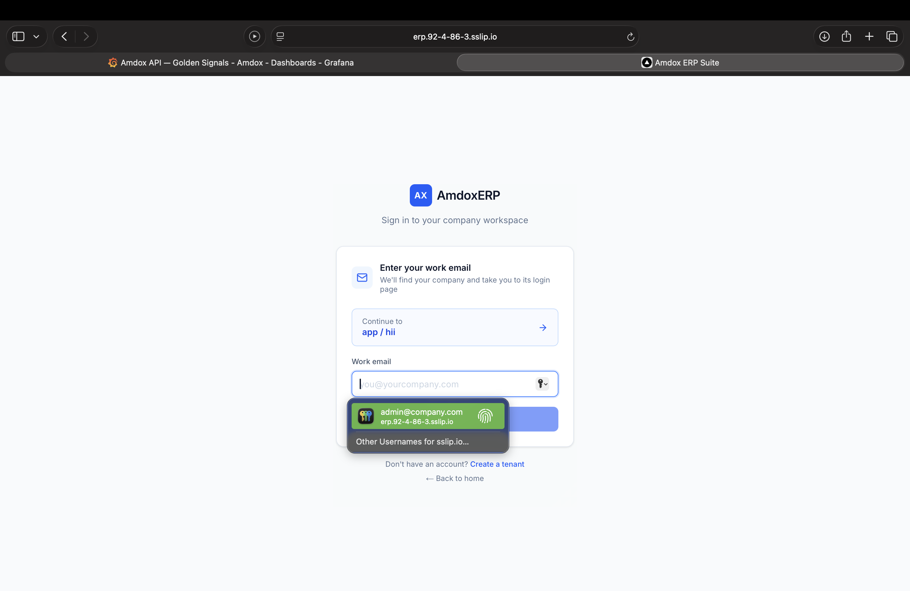
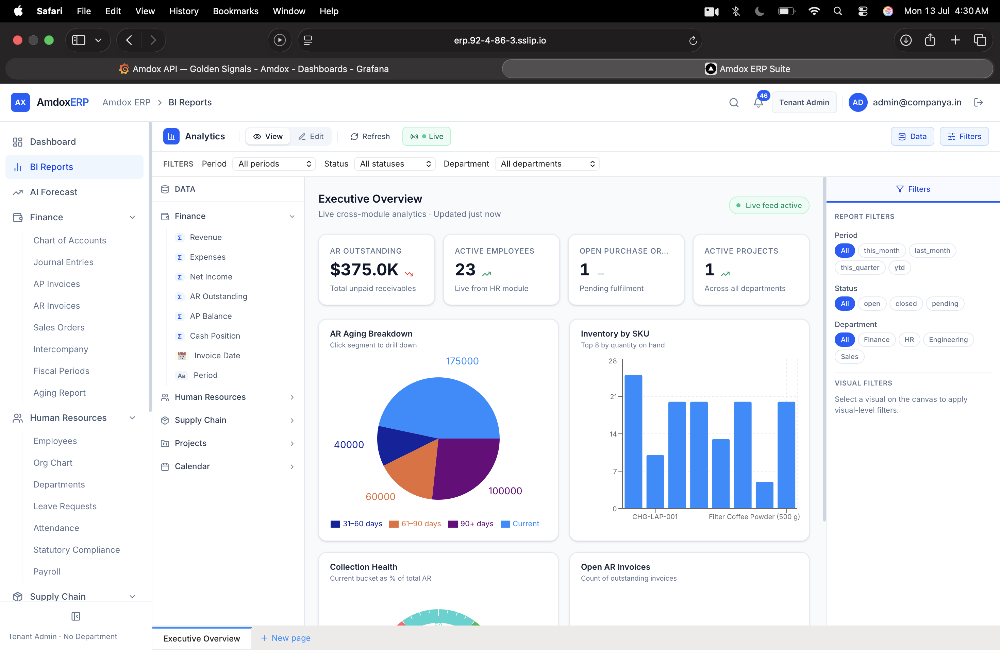
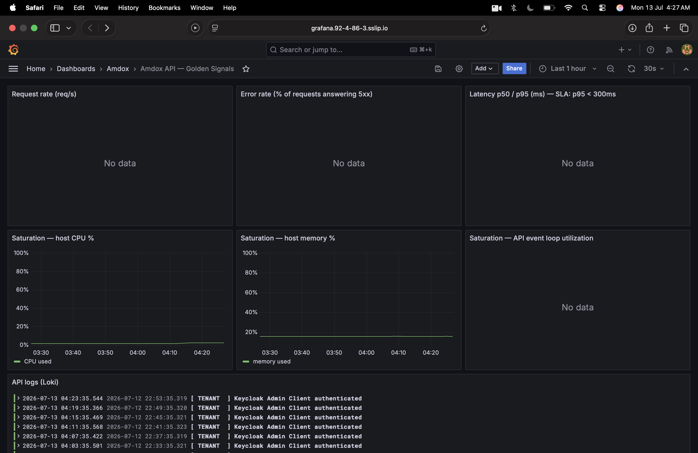
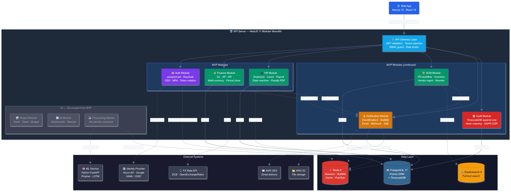

# Amdox AI-Powered Cloud ERP Suite

Welcome to the **Amdox ERP** monorepo workspace. This project uses `pnpm` workspaces and `Turborepo` to manage our applications and shared packages.

---

## 🎥 Demo Video
LinkedIn post (full-stack development): https://www.linkedin.com/posts/agrim-gupta-b37748332_erp-fullstackdevelopment-reactjs-ugcPost-7481983427156631552-w-5k/?utm_source=share&utm_medium=member_desktop&rcm=ACoAAFPCdFsBaSccFtDfF9mn4gnwbJkh_GYpYrU

## 🌐 Live Demo

|                         |                                                                                         |
| ----------------------- | --------------------------------------------------------------------------------------- |
| **App**                 | https://erp.92-4-86-3.sslip.io                                                          |
| **API docs (Swagger)**  | https://erp.92-4-86-3.sslip.io/api-docs                                                 |
| **Identity (Keycloak)** | https://kc.92-4-86-3.sslip.io                                                           |
| **Tenant slug**         | `company-a`                                                                             |
| **Admin login**         | `admin@companya.in` / `Admin123!` (full role list: `docs/company-a-employee-logins.md`) |

Deployed on Oracle Cloud with Caddy (automatic HTTPS via Let's Encrypt), pm2-managed production builds, and the Docker infrastructure stack (PostgreSQL, Redis, Keycloak, MinIO, Elasticsearch).

---

## Workspace Structure

> ERD reference: `docs/erd/database-erd.md`

Here is the exact current folder and file structure of our monorepo:

⁠ text
amdox-erp/
├── .github/
│   └── workflows/
├── apps/
│   ├── api/                           # NestJS Backend API (Initialized Structure)
│   │   ├── src/
│   │   │   ├── audit/
│   │   │   ├── auth/
│   │   │   ├── common/
│   │   │   ├── finance/
│   │   │   ├── health/
│   │   │   ├── hr/
│   │   │   ├── notification/
│   │   │   └── scm/
│   │   └── test/
│   ├── ml-service/
│   └── web/                           # Next.js Frontend
│       ├── public/
│       ├── src/
│       │   ├── app/
│       │   ├── components/
│       │   ├── hooks/
│       │   ├── lib/
│       │   ├── stores/
│       │   └── styles/
├── docs/
│   ├── adr/
│   ├── api/
│   │   └── openapi.yaml
│   ├── c4/
│   │   ├── component.md
│   │   ├── component_clean.md
│   │   ├── container.md
│   │   └── context.md
│   ├── erd/
│   │   ├── Data_Processing_and_Model.png
│   │   └── database-erd.md
│   ├── frontend_development.md
│   └── monorepo_structure.md
├── packages/
│   ├── config/
│   │   └── .gitkeep
│   ├── db/                            # Shared Database Package
│   │   ├── prisma/
│   │   │   └── schema.prisma          # Prisma Schema with all 24 entities
│   │   ├── src/
│   │   │   └── client.ts              # Prisma Client Singleton
│   │   ├── package.json
│   │   └── tsconfig.json
│   ├── types/
│   │   └── .gitkeep
│   └── ui/
│       └── .gitkeep
├── scripts/
│   └── create-api-dirs.ps1
├── .gitignore
├── package.json
├── pnpm-workspace.yaml
├── tsconfig.json
└── turbo.json
 ⁠

---

## Getting Started (Local Development Setup)

Follow these exact steps to configure your environment, set up the database, and configure Keycloak for local testing.

### Step 1: Start Databases & Services

Boot up PostgreSQL, Redis, and Keycloak running locally in Docker containers:

⁠ bash
docker compose -f infra/docker/docker-compose.yml up -d
 ⁠

### Step 2: Configure Environment Variables

Initialize your local environment files by copying the provided templates:

⁠ bash
# 1. Setup the main project variables
cp .env.example .env

# 2. Setup the Prisma database variables (CRITICAL)
# This uses the `erp` schema to keep it safely separated from Keycloak!
cd packages/db
cp .env.example .env
cd ../..
 ⁠

### Step 3: Setup Keycloak (SSO)

Run the automated script to configure Keycloak. This will create the ⁠ amdox-erp ⁠ realm, the client app, and a dummy user (⁠ erp-admin ⁠ / password: ⁠ password123 ⁠):

⁠ powershell
# Run this from the root directory
.\scripts\setup-keycloak.ps1
 ⁠

### Step 4: Build Database & Insert Dummy Data

Now we need to tell Prisma to build the tables and insert our dummy Tenant and ⁠ erp-admin ⁠ User so you can actually log in.

⁠ bash
cd packages/db
npx prisma db push
npm run db:seed
cd ../..
 ⁠

(Note: Do not skip Step 2's ⁠ .env ⁠ file before running this, or Prisma might accidentally delete Keycloak's tables!)

---

## Running the Application

Once your databases are initialized, you can launch the application services using one of these workflows:

### Option A: Run the Entire Stack (Recommended)

This starts both the *Next.js Web Frontend* and *NestJS API Backend* concurrently:

⁠ bash
npx pnpm dev
 ⁠

### Option B: Run the Frontend Only

If you are only working on user interface components and do not need a local backend database:

⁠ bash
# From the project root (recommended)
npx pnpm --filter web dev

# OR navigate to the folder directly
cd apps/web
npx pnpm dev
 ⁠

Note: Refer to [docs/frontend_development.md](file:///d:/amdox-erp/docs/frontend_development.md) for pointing your local frontend to remote staging APIs.

### Option C: Run the Backend Only

If you are only working on API endpoints:

⁠ bash
npx pnpm --filter api dev
 ⁠

---

## Database Management & Tools

### Visual Database Browser (Prisma Studio)

To visually inspect, search, and edit database records (opens a browser app at ⁠ http://localhost:5555 ⁠):

⁠ bash
npx pnpm --filter @amdox/db exec prisma studio
 ⁠

### Shared Database Workspace Scripts

All database actions are centralized under the ⁠ @amdox/db ⁠ package. You can run these commands from the root:

•⁠  ⁠*⁠ npx pnpm db:generate ⁠* — Re-generates the database client types after schema changes.
•⁠  ⁠*⁠ npx pnpm db:migrate ⁠* — Applies schema changes and updates the database tables.
•⁠  ⁠*⁠ npx pnpm db:seed ⁠* — Seeds the database with development mock data.

---

## API Documentation & Testing

### Interactive Swagger UI

When the NestJS API is running locally, it automatically generates a live, interactive Swagger documentation page.
You can view all available endpoints, required payloads, and test them directly from your browser:

•⁠  ⁠*URL:* [http://localhost:3001/api-docs](http://localhost:3001/api-docs)

### Auto-generated Postman Collection

The API automatically generates an OpenAPI specification file (⁠ openapi-spec.json ⁠) when it starts up. You can instantly convert this into a ready-to-use Postman collection for your team:

⁠ bash
npx pnpm --filter api run postman
 ⁠

This generates a ⁠ postman_collection.json ⁠ file inside the ⁠ apps/api ⁠ folder which you can import directly into Postman to test all routes.

---

## Known Deviations from the TDD

The full requirement-by-requirement audit lives in [⁠ docs/TDD-Audit-Report.md ⁠](docs/TDD-Audit-Report.md). These deviations are *deliberate scope decisions*, documented here per the TDD's own Day-1 instruction to "define MVP feature scope and de-scope list":

| Area                 | TDD asked for                             | What we built & why                                                                                                                                                                                                 |
| -------------------- | ----------------------------------------- | ------------------------------------------------------------------------------------------------------------------------------------------------------------------------------------------------------------------- |
| MFA / token rotation | MFA enforced per tenant                   | Delegated to Keycloak realm configuration (supported, not switched on in the demo realm). Realm-per-tenant itself *is* implemented — every tenant gets its own Keycloak realm created programmatically at signup. |
| 3-way matching       | Line-by-line PO/GR/Invoice match          | Header-level match: invoice total vs. PO total within a 2% tolerance, plus vendor and GR-ownership checks. Line-level matching requires per-line goods-receipt quantities (see roadmap).                            |
| Goods receipt        | Partial receipts (⁠ PARTIALLY_RECEIVED ⁠)   | Full-order receipt only; the status exists in the schema for the roadmap item.                                                                                                                                      |
| Multi-currency       | FX conversion on transactions             | Daily ECB rates are fetched and stored per tenant; conversion at posting time is not yet applied. All demo data is single-currency (INR display).                                                                   |
| Reorder automation   | "Trigger PO draft when stock < threshold" | Raises a *purchase requisition* instead — the more correct procurement document; a human converts it to a PO.                                                                                                     |
| Audit log storage    | TimescaleDB append-only                   | Regular PostgreSQL table *with SHA-256 hash chaining* — the tamper-evidence requirement is met; the time-series engine was dropped as unnecessary at this scale.                                                  |
| Notification retries | "Retry up to 3x"                          | 5 attempts with exponential backoff + dead-letter view in Bull Board (exceeds spec).                                                                                                                                |
| Org chart            | Recursive CTE in Postgres                 | Tree assembled client-side from ⁠ managerId ⁠ — simpler, fine at demo scale.                                                                                                                                          |
| Journal entries      | (implied draft→post workflow)             | Entries post directly as balanced, immutable records; corrections are made by counter-entries, as in classical bookkeeping.                                                                                         |
| Payroll saga         | Compensating transactions on failure      | Implemented as a compensation step: a retried run wipes the failed attempt's payslips before reprocessing (verified by ⁠ apps/api/scripts/verify-payroll-retry.ts ⁠).                                                 |

### Not yet implemented (roadmap)

•⁠  ⁠*Offline / PWA (F-12)* — service-worker caching and sync-on-reconnect
•⁠  ⁠*Observability stack* — OpenTelemetry / Prometheus / Grafana / Loki (health endpoints and structured logging exist today)
•⁠  ⁠*k6 load-test evidence* for the 2,000-concurrent-user NFR
•⁠  ⁠*Leave accrual rules* (leave request/approval workflow works; balances don't accrue)
•⁠  ⁠*Forecast accuracy monitoring* (MAPE is computed per prediction but the <12% target isn't alerted on)
•⁠  ⁠*Line-level 3-way matching + partial goods receipts* (one schema change unlocks both)
•⁠  ⁠*Drag-and-drop dashboard editing* (layouts persist; rearranging is not yet mouse-driven)
