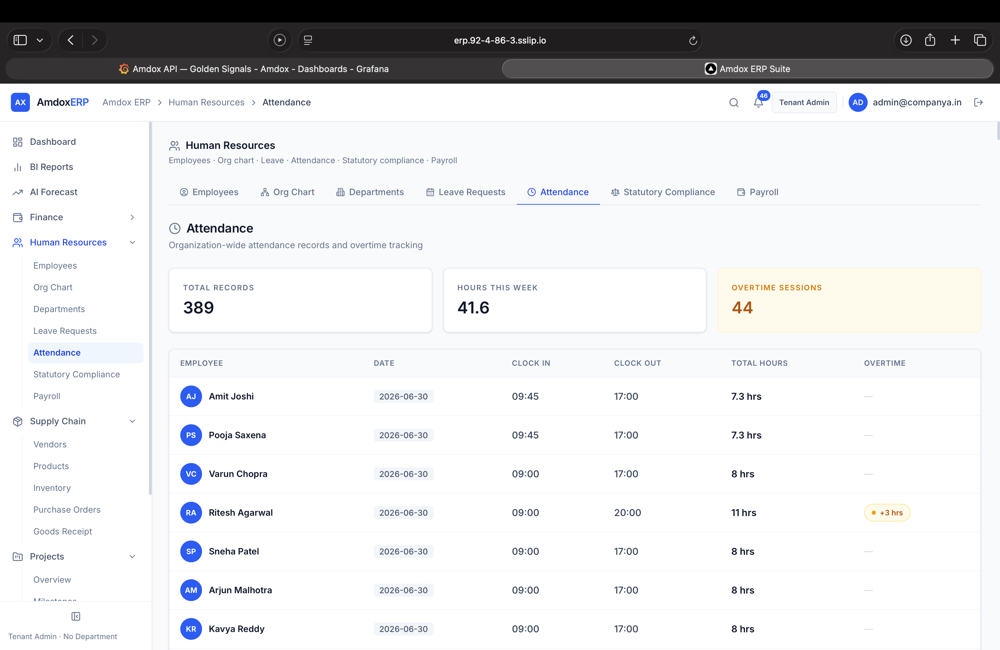
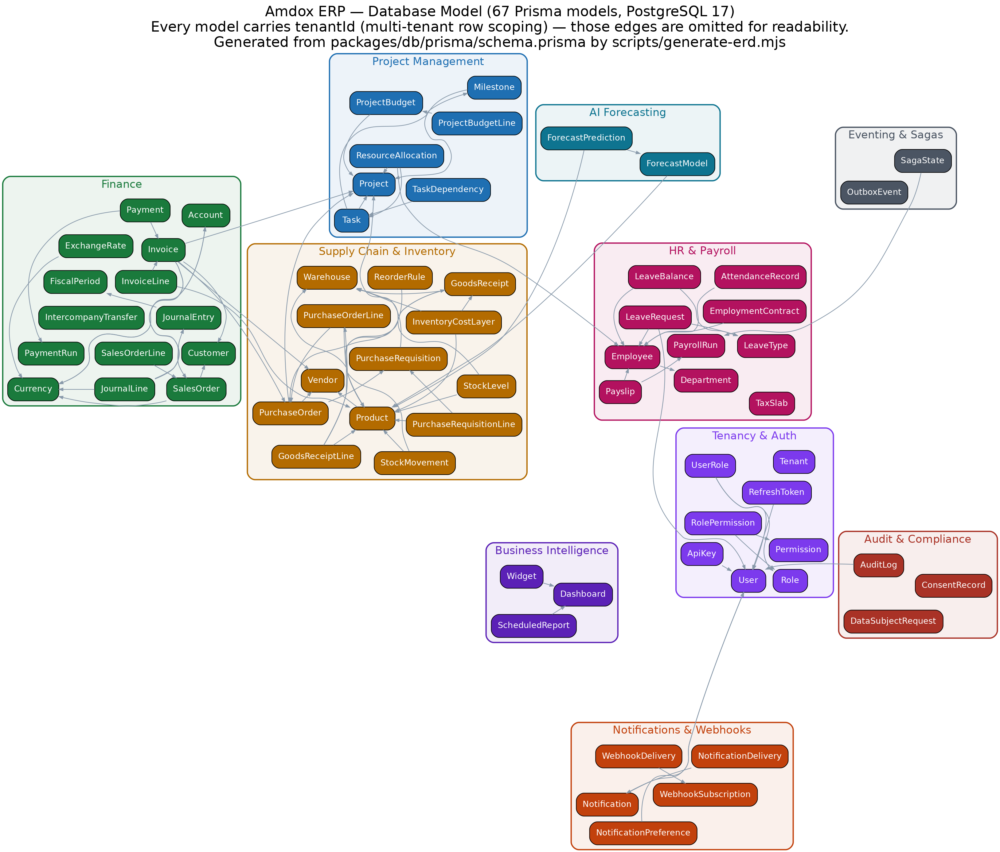

# Amdox AI-Powered Cloud ERP Suite

Welcome to the **Amdox ERP** monorepo workspace. This project uses `pnpm` workspaces and `Turborepo` to manage our applications and shared packages.

---

## 🎥 Demo Video

LinkedIn post (full-stack development): https://www.linkedin.com/posts/agrim-gupta-b37748332_erp-fullstackdevelopment-reactjs-ugcPost-7481983427156631552-w-5k/?utm_source=share&utm_medium=member_desktop&rcm=ACoAAFPCdFsBaSccFtDfF9mn4gnwbJkh_GYpYrU

## 🌐 Live Demo

|                         |                                                                                                |
| ----------------------- | ---------------------------------------------------------------------------------------------- |
| **App**                 | https://erp.92-4-86-3.sslip.io                                                                 |
| **API docs (Swagger)**  | https://erp.92-4-86-3.sslip.io/api-docs                                                        |
| **Identity (Keycloak)** | https://kc.92-4-86-3.sslip.io                                                                  |
| **Tenant slug**         | `company-a`                                                                                    |
| **Admin login**         | `admin@companya.in` / `Admin123!` (full role list: `docs/guides/company-a-employee-logins.md`) |

Deployed on Oracle Cloud with Caddy (automatic HTTPS via Let’s Encrypt), pm2-managed production builds, and the Docker infrastructure stack (PostgreSQL 17 + TimescaleDB, Redis, Keycloak, MinIO, Elasticsearch).







> ERD reference: `docs/erd/database-erd.md` — auto-generated from the live Prisma schema (67 models) via `node scripts/reporting/generate-erd.mjs`

---

## 📊 Project Status

**39 done · 2 partial · 2 open** out of 43 tracked tasks (Frontend 18/18, Backend 9/11, Integrations 9/9, Platform 3/5). Full breakdown with evidence: `docs/planning/team_assignment.md`.

The only remaining P0: recording the 5–7 min scenario-based demo video. Everything else — including the live deployment, auth hardening (SSO auto-link + per-tenant MFA), and the observability stack below — is built and verified against the running system, not just planned.

## 🏗️ Architecture

| Doc                                          | Covers                                                                        |
| -------------------------------------------- | ----------------------------------------------------------------------------- |
| `docs/architecture/backend_architecture.md`  | NestJS module layout, request lifecycle, tenant isolation, RBAC guards        |
| `docs/architecture/frontend_architecture.md` | Next.js app router structure, state management, API client layer              |
| `docs/erd/database-erd.md` (rendered above)  | Full Prisma schema — 67 models across every module                            |
| `docs/architecture/auth-flow.md`             | Login flow (password / Google / company SSO), auto-link, MFA — with a diagram |
| `docs/architecture/observability.md`         | OTel + Prometheus/Grafana/Loki/Tempo stack, public dashboard URLs             |
| `docs/c4/`                                   | C4 context/container/component diagrams                                       |

A deployment topology diagram (VM/Caddy/pm2/Docker layout) is not yet drawn — the architecture docs above describe it in prose today.

---

## Workspace Structure

Here is the exact current folder and file structure of our monorepo:

```text
amdox-erp/
├── .github/
│   └── workflows/
├── apps/
│   ├── api/                            # NestJS Backend API
│   │   ├── src/
│   │   │   ├── audit/                 # business modules — one folder per capability
│   │   │   ├── auth/
│   │   │   ├── bi/
│   │   │   ├── finance/                (ap, ar, gl, fx, sales, automation, listeners)
│   │   │   ├── forecast/
│   │   │   ├── hr/                     (employee, payroll, leave, attendance, department, compliance)
│   │   │   ├── infrastructure/         # cross-cutting, not business capabilities
│   │   │   │   ├── common/             (guards, interceptors, logger, redis, storage, throttler)
│   │   │   │   ├── graphql/
│   │   │   │   ├── health/
│   │   │   │   ├── observability/
│   │   │   │   ├── queues/             (shared BullMQ queue-name constants)
│   │   │   │   └── search/
│   │   │   ├── notification/
│   │   │   ├── pm/
│   │   │   ├── scm/                    (purchase, requisition, inventory, vendor, vendor-portal, product, automation)
│   │   │   └── tenant/
│   │   ├── scripts/                    # in-package scripts, see scripts/README.md there
│   │   └── test/
│   ├── ml-service/                    # Python FastAPI demand-forecasting microservice
│   └── web/                           # Next.js Frontend
│       ├── public/
│       ├── src/
│       │   ├── app/
│       │   ├── components/
│       │   ├── hooks/
│       │   ├── lib/
│       │   ├── stores/
│       │   └── styles/
├── docs/
│   ├── architecture/                  # system design docs
│   ├── audits/                        # point-in-time audit reports
│   ├── planning/                      # task tracking / project status
│   ├── guides/                        # setup / how-to docs
│   ├── reference/                     # static reference material (original TDD, etc.)
│   ├── adr/                           # Architecture Decision Records
│   ├── api/
│   │   └── openapi.yaml
│   ├── c4/                            # Mermaid-based C4 diagrams (companion to the team's Eraser diagrams)
│   │   ├── component.md
│   │   ├── component_clean.md
│   │   ├── container.md
│   │   └── context.md
│   ├── erd/
│   │   ├── database-erd.md            # generated: full ERD + mermaid relations
│   │   ├── database-erd.png           # generated: ERD image (node scripts/reporting/generate-erd.mjs)
│   │   └── schema.prisma              # synced copy of the live schema
│   ├── learning/                      # day-by-day concept walkthroughs
│   ├── screenshots/                   # README/report screenshots
│   ├── fixtures/                      # sample test files
│   ├── doubts/                        # open business-rule questions
│   └── README.md                      # index of the above
├── packages/
│   ├── config/
│   │   └── .gitkeep
│   ├── db/                            # Shared Database Package
│   │   ├── prisma/
│   │   │   └── schema.prisma          # Prisma Schema — 67 models
│   │   ├── src/
│   │   │   └── client.ts              # Prisma Client Singleton
│   │   ├── package.json
│   │   └── tsconfig.json
│   ├── types/
│   │   └── .gitkeep
│   └── ui/
│       └── .gitkeep
├── scripts/                           # repo-wide ops/dev tooling, see scripts/README.md
│   ├── keycloak/
│   ├── data-seed/
│   ├── scaffolding/
│   └── reporting/
├── testing/                           # standalone black-box API test project, see testing/README.md
├── report/                            # final submission package (PDF/tex + images)
├── .gitignore
├── package.json
├── pnpm-workspace.yaml
├── tsconfig.json
└── turbo.json
```

---

Key workspaces:

- `apps/api` — NestJS Backend API
- `apps/web` — Next.js Frontend
- `apps/ml-service` — Forecasting/ML microservice

Shared packages:

- `packages/db` — Prisma schema + tenant-aware DB client
- `packages/types` — shared TypeScript contracts
- `packages/ui` — shared UI primitives
- `packages/config` — shared lint/tsconfig/prettier presets

---

## Getting Started (Local Development Setup)

Follow these exact steps to configure your environment, set up the database, and configure Keycloak for local testing.

### Step 1: Start Databases & Services

Boot up PostgreSQL, Redis, and Keycloak running locally in Docker containers:

```bash
docker compose -f infra/docker/docker-compose.yml up -d
```

### Step 2: Configure Environment Variables

Initialize your local environment files by copying the provided templates:

```bash
# 1) Setup the main project variables
cp .env.example .env

# 2) Setup the Prisma database variables (CRITICAL)
# This uses the `erp` schema to keep it safely separated from Keycloak!
cd packages/db
cp .env.example .env
cd ../..
```

### Step 3: Setup Keycloak (SSO)

Run the automated script to configure Keycloak. This will create the `amdox-erp` realm, the client app, and a dummy user (`erp-admin` / password: `password123`):

```powershell
# Run this from the root directory
# Windows PowerShell
.\scripts\keycloak\setup-keycloak.ps1
```

> If you are on macOS/Linux, use: `./scripts/keycloak/setup-keycloak.sh`

### Step 4: Build Database & Insert Dummy Data

Now we need to tell Prisma to build the tables and insert our dummy Tenant and `erp-admin` User so you can actually log in.

```bash
cd packages/db
npx prisma db push
npm run db:seed
cd ../..
```

> Note: Step 2’s `.env` must be set before Prisma commands, otherwise Prisma may operate on the wrong database.

---

## Running the Application

### Option A: Run the Entire Stack (Recommended)

Starts both the **Next.js Web Frontend** and **NestJS API Backend** concurrently:

```bash
npx pnpm dev
```

### Option B: Run the Frontend Only

If you are only working on UI components and do not need a local backend database:

```bash
# From the project root
npx pnpm --filter web dev

# OR
cd apps/web
npx pnpm dev
```

Refer to `docs/guides/frontend_development.md` for pointing the local frontend to remote/staging APIs.

### Option C: Run the Backend Only

```bash
npx pnpm --filter api dev
```

---

## Database Management & Tools

### Visual Database Browser (Prisma Studio)

Opens a browser app at `http://localhost:5555`:

```bash
npx pnpm --filter @amdox/db exec prisma studio
```

### Shared Database Workspace Scripts

All database actions are centralized under the `@amdox/db` package. Run these from the repo root:

- `npx pnpm db:generate` — regenerate Prisma client types after schema changes
- `npx pnpm db:migrate` — apply schema migrations
- `npx pnpm db:seed` — seed dev/mock data

---

## API Documentation & Testing

### Interactive Swagger UI

When the NestJS API is running locally, Swagger is available at:

- `http://localhost:3001/api-docs`

### Auto-generated Postman Collection

Generate a Postman collection from OpenAPI:

```bash
npx pnpm --filter api run postman
```

This produces `postman_collection.json` inside the `apps/api` folder.

---

## Known Deviations from the TDD

The full requirement-by-requirement audit lives in `docs/audits/TDD-Audit-Report.md`.

| Area                 | TDD asked for                           | What we built & why                                                                                                                                         |
| -------------------- | --------------------------------------- | ----------------------------------------------------------------------------------------------------------------------------------------------------------- |
| Token rotation       | Refresh-token rotation                  | Configurable per tenant in Settings → Identity Settings; off by default. MFA is fully built (auto-link + per-tenant enforcement) and no longer a deviation. |
| Multi-currency       | FX conversion on transactions           | Daily ECB rates fetched/stored per tenant; conversion at posting time not applied yet (demo single-currency).                                               |
| Reorder automation   | Trigger PO draft when stock < threshold | Raises purchase requisition instead; a human converts it to a PO.                                                                                           |
| Notification retries | Retry up to 3x                          | 5 attempts with exponential backoff + dead-letter view (exceeds spec).                                                                                      |
| Org chart            | Recursive CTE in Postgres               | Tree assembled client-side from `managerId` (fine for demo scale).                                                                                          |
| Journal entries      | Draft→post workflow implied             | Entries post directly as balanced immutable records; corrections via counter-entries.                                                                       |
| Payroll saga         | Compensating transactions on failure    | Compensation step: retried run wipes failed attempt payslips before reprocessing.                                                                           |

---

### Not yet implemented (roadmap)

- _Offline / PWA (F-12)_ — service-worker caching and sync-on-reconnect

---
