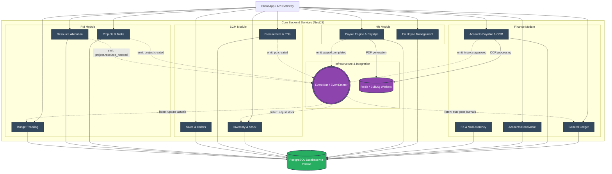

# Amdox ERP Backend Architecture

This document provides a high-level overview of the entire Amdox ERP backend architecture, detailing the domain modules, infrastructure, and event-driven communication flow.

## How It Works:
1. **Domain Isolation**: Each major department (Finance, HR, SCM, PM) is strictly isolated into its own NestJS module.
2. **Event-Driven**: Modules communicate via the `Event Bus` rather than direct function calls, preventing "spaghetti code". For example, when Payroll is completed, it simply emits a `payroll.completed` event. The Finance GL listens to this event to automatically post journal entries.
3. **Background Jobs**: Heavy operations (like OCR scanning invoices or generating Payslip PDFs) are sent to Redis/BullMQ to keep the API blazing fast.
