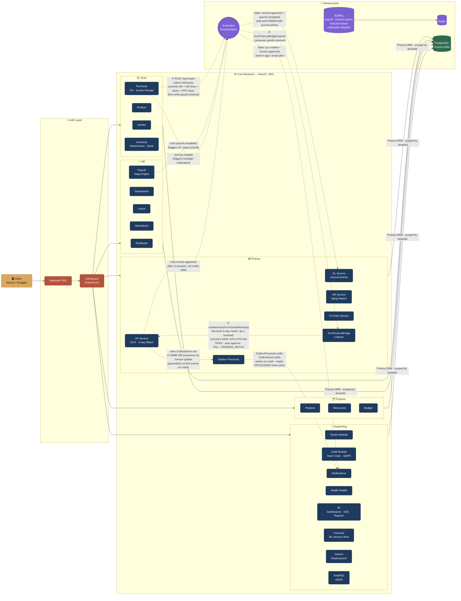

# Amdox ERP — Backend Architecture

This document reflects the **current, live** backend architecture as implemented in `apps/api/src`.
Last updated: July 2026.

---

## System Architecture Diagram

---

## Reading the Diagram

### Arrow Types

There are two kinds of arrows in the diagram. Think of them like this:

| Arrow                        | Looks like | Meaning                       | When it happens                                                              |
| ---------------------------- | ---------- | ----------------------------- | ---------------------------------------------------------------------------- |
| **Solid `-->`**              | `────►`    | **Synchronous / direct call** | Happens immediately, the caller waits for the result                         |
| **Dashed `-.->` with label** | `- - - ►`  | **Async / event-driven**      | Fires and forgets — the caller does NOT wait. Work happens in the background |

---

### Every Connection Explained

#### 🔐 Request Entry & Auth (left side of diagram)

| Connection                           | What is actually happening                                                                                                                                                                               |
| ------------------------------------ | -------------------------------------------------------------------------------------------------------------------------------------------------------------------------------------------------------- |
| `Client → Keycloak (KC)`             | Every HTTP request must carry a **Bearer JWT token**. The request first hits the `AuthGuard` which validates the token against Keycloak. If invalid → `401 Unauthorized` is returned immediately.        |
| `KC → AuthGuard (AG)`                | After token validation passes, `RolesGuard` checks if the logged-in user has the required role for that endpoint (e.g. `Manager` role is needed to approve a PO). If role check fails → `403 Forbidden`. |
| `AG → FIN / HR / SCM / PM / SUPPORT` | Once auth passes, the request is forwarded to the correct NestJS module controller. Each module handles its own routes independently.                                                                    |

---

#### 🗄️ Database Writes (all modules → DB)

| Connection                           | What is actually happening                                                                                                                                                                        |
| ------------------------------------ | ------------------------------------------------------------------------------------------------------------------------------------------------------------------------------------------------- |
| `FIN / HR / SCM / PM / SUPPORT → DB` | Every module uses **Prisma ORM** to read/write PostgreSQL. All queries are automatically scoped to the current tenant's `tenantId` — so Company A's data can never leak into Company B's queries. |

---

#### 📦 SCM → Finance: The 3-Way Match Flow (dashed arrows, numbered ①②③)

This is the most important async flow in the whole system. A human triggers it, then the system does the rest automatically.

| Connection                                                       | What is actually happening                                                                                                                                                                                                                                                                                                                                                                                               |
| ---------------------------------------------------------------- | ------------------------------------------------------------------------------------------------------------------------------------------------------------------------------------------------------------------------------------------------------------------------------------------------------------------------------------------------------------------------------------------------------------------------ |
| `PURCH -.-> ① goods.received → EB`                               | A warehouse employee calls `POST /scm/purchase-orders/:id/receive` (optionally with **per-line quantities** — omitting them receives everything outstanding). `PurchaseService` commits the `GoodsReceipt`, its `GoodsReceiptLine`s, stock upserts, and the FIFO cost layer **inside one DB transaction**, sets the PO to `RECEIVED` or `PARTIALLY_RECEIVED`, then emits a `goods.received` event on the in-process bus. |
| `EB -.-> ② consume → BRIDGE`                                     | The `ScmFinanceBridgeListener` (Finance module) consumes `goods.received`. ⚠️ History note: this used to _also_ be enqueued on a `scm-events` BullMQ queue — both consumers raced past the idempotency check and created **two** approved AP invoices per receipt (double GL/budget posting). The queue path was removed; exactly one invoice is created per receipt.                                                    |
| `BRIDGE -.-> ③ createInvoiceFromGoodsReceipt + 3-way match → AP` | The listener creates an AP invoice **billing only what actually arrived** and runs the **line-level 3-way match** (`performThreeWayMatch`, a pure function): for every invoice line — invoiced quantity ≤ received quantity, and unit price within ±2% of the PO line price; header-total fallback when lines can't be resolved to products. PASS → auto-approved. FAIL → `PENDING_MATCH` for manual review.             |

---

#### ⚡ In-Process Events (EventEmitter2 — dashed arrows)

These events happen **inside the same Node.js process** using EventEmitter2. They are fast (no network hop) but not durable — if the server crashes between emit and handler, the event is lost. That is why we also use the Outbox pattern (see below).

| Connection                              | What is actually happening                                                                                                                                                                                                                           |
| --------------------------------------- | ---------------------------------------------------------------------------------------------------------------------------------------------------------------------------------------------------------------------------------------------------- |
| `AP -.-> emit: invoice.approved → EB`   | When an AP invoice is approved (either auto or manually), `ApService` emits an `invoice.approved` event onto the in-process Event Bus. Any listener registered for this event runs synchronously in the same request cycle.                          |
| `PAY -.-> emit: payroll.completed → EB` | When a payroll run finishes (all employee salaries calculated), `PayrollService` emits `payroll.completed`. The GL listener picks this up to auto-post salary journal entries — Debit: Salary Expense / Credit: Cash.                                |
| `PURCH -.-> emit: po.created → EB`      | When a new Purchase Order is created, `PurchaseService` emits `po.created`. The Notification module listens to this to send an alert to the approving manager.                                                                                       |
| `EB -.-> auto-post journals → GL`       | The `GlService` listens for `invoice.approved` and `payroll.completed` events. On receiving them, it automatically creates the correct double-entry journal (e.g. Debit AP / Credit Cash for a paid invoice). This removes any manual GL entry work. |
| `EB -.-> notify → NOTIF`                | The `NotificationService` listens for several events (`po.created`, `invoice.approved`) and sends in-app or email notifications to relevant users.                                                                                                   |

---

#### 📬 Outbox Pattern (durable event delivery)

The EventEmitter2 events above are "fire and forget" — they work but are not crash-safe. The Outbox pattern solves this.

| Connection                            | What is actually happening                                                                                                                                                                                                                                                                                                     |
| ------------------------------------- | ------------------------------------------------------------------------------------------------------------------------------------------------------------------------------------------------------------------------------------------------------------------------------------------------------------------------------ |
| `AP -.-> write outbox event → OUTBOX` | When `ApService` approves an invoice, it writes an `OutboxEvent` row to PostgreSQL **in the same DB transaction** as the invoice status update. This means either both succeed or both fail — there is no way to update the invoice without also creating the outbox record.                                                   |
| `OUTBOX -.-> deliver → NOTIF`         | A separate `OutboxProcessor` BullMQ worker polls the `OutboxEvent` table, finds undelivered events, and delivers them to consumers (like Notification). Once delivered, it marks the event as `PROCESSED`. If the server crashes, the next startup re-reads unprocessed outbox rows and retries — **no events are ever lost**. |

---

#### 🔌 Infrastructure (BullMQ + Redis)

| Connection     | What is actually happening                                                                                                                                                                                                                                  |
| -------------- | ----------------------------------------------------------------------------------------------------------------------------------------------------------------------------------------------------------------------------------------------------------- |
| `BULL → REDIS` | BullMQ uses Redis as its job store. Every enqueued job (e.g. `goods.received`) is persisted in Redis with its payload, retry count, and status. If a worker crashes mid-job, Redis still holds the job and BullMQ will retry it on the next worker startup. |

---

## Module Breakdown

### Finance Module (`/finance`)

| Sub-module           | Controller Route                                            | Key Responsibilities                                                                      |
| -------------------- | ----------------------------------------------------------- | ----------------------------------------------------------------------------------------- |
| **AP**               | `POST/GET /finance/ap/invoices`                             | Vendor invoice lifecycle, OCR extraction, 3-way match, manual approval                    |
| **AR**               | `POST /finance/ar/invoices`, `GET /finance/ar/aging-report` | Customer invoicing, payment recording, aging report                                       |
| **GL**               | `POST /finance/gl/journal-entries`                          | Double-entry journal posting, fiscal period lock check                                    |
| **FX**               | Internal service                                            | Daily ECB rate fetch (29 currencies, per tenant); conversion-at-posting is a roadmap item |
| **Outbox Processor** | BullMQ worker                                               | Durable event delivery for `invoice.approved` events                                      |
| **ScmFinanceBridge** | Event listener                                              | `goods.received` → AP invoice creation + line-level 3-way match                           |

### HR Module (`/hr`)

| Sub-module     | Controller Route     | Key Responsibilities                                 |
| -------------- | -------------------- | ---------------------------------------------------- |
| **Employee**   | `/hr/employees`      | CRUD, leave balance initialisation on hire           |
| **Department** | `/hr/departments`    | Org hierarchy management                             |
| **Leave**      | `/hr/leave-requests` | Leave request lifecycle, approval workflow           |
| **Attendance** | `/hr/attendance`     | Clock-in/out, overtime tracking                      |
| **Payroll**    | `/hr/payroll`        | Saga-based payroll run, tax slab, payslip generation |

### SCM Module (`/scm`)

| Sub-module    | Controller Route       | Key Responsibilities                                                                              |
| ------------- | ---------------------- | ------------------------------------------------------------------------------------------------- |
| **Vendor**    | `/scm/vendors`         | Full CRUD — create, read, update, delete vendors                                                  |
| **Product**   | `/scm/products`        | SKU management, unit cost tracking                                                                |
| **Purchase**  | `/scm/purchase-orders` | PO creation, approval, goods receipt (full or per-line partial) + stock upsert + FIFO cost layers |
| **Inventory** | `/scm/inventory`       | Warehouse CRUD, stock movements, reorder rules                                                    |

### PM Module (`/pm`)

| Sub-module   | Controller Route | Key Responsibilities                           |
| ------------ | ---------------- | ---------------------------------------------- |
| **Project**  | `/pm/projects`   | Project lifecycle (Planning → Active → Closed) |
| **Resource** | `/pm/resources`  | Employee allocation to tasks, hour tracking    |
| **Budget**   | `/pm/budgets`    | Budget vs actuals, overrun threshold alerts    |

### Analytics & Platform Modules

| Module            | Controller Route | Key Responsibilities                                                                                                                                           |
| ----------------- | ---------------- | -------------------------------------------------------------------------------------------------------------------------------------------------------------- |
| **BI**            | `/bi`            | Dashboards + widget CRUD, KPI/drill-down data service, SSE metric stream, scheduled PDF/XLSX reports                                                           |
| **Forecast**      | `/forecast`      | Client of the Python ml-service (Prophet + LSTM); Redis-cached predictions; weekly `forecast-retrain` BullMQ job; `forecast.mape_breach` alert when MAPE > 12% |
| **Search**        | `/search`        | Elasticsearch global search over 10 entity types with real-time index sync (graceful degradation when ES is down)                                              |
| **GraphQL**       | `/graphql`       | Apollo server with auth guard, BI-style flexible queries                                                                                                       |
| **Notification**  | `/notifications` | In-app (SSE) + email + SMS + HMAC webhook channels, per-user/channel preferences, `notification-dispatch` queue (5 retries, Bull Board DLQ at `/admin/queues`) |
| **Audit**         | `/audit`         | Hash-chained audit log + verification, GDPR DSR/consent endpoints                                                                                              |
| **Tenant**        | `/tenant`        | Tenant signup (creates a dedicated Keycloak realm), module licensing config                                                                                    |
| **Observability** | —                | OpenTelemetry traces + metrics wiring (see `docs/observability.md`)                                                                                            |

---

## How It Works

### 1. Multi-Tenant Isolation

Every API request carries a JWT from Keycloak. The `TenantContextInterceptor` extracts `tenantId` from the validated token and injects it into every DB query — ensuring one tenant's data is never visible to another.

### 2. Authentication & RBAC

- **Keycloak JWT Strategy** verifies the Bearer token on every protected route.
- **RolesGuard** checks the `roles` claim in the token against `@Roles(...)` on each endpoint.
- Roles in use: `SuperAdmin`, `TenantAdmin`, `Manager`, `Viewer`, `Employee`.
- **Full role matrix:** see [`docs/rbac-role-matrix.md`](./rbac-role-matrix.md) (BE-11 audit, July 2026).

### 3. SCM → Finance Event Flow (3-Way Match)

Think of this like a conveyor belt:

1. Warehouse staff mark a PO as received via `POST /scm/purchase-orders/:id/receive` — either everything outstanding (one click) or **specific per-line quantities** (partial delivery → PO becomes `PARTIALLY_RECEIVED`).
2. `PurchaseService` commits the `GoodsReceipt` + `GoodsReceiptLine`s + stock + FIFO cost layer in one DB transaction, then emits `goods.received` on the in-process event bus.
3. `ScmFinanceBridgeListener` (Finance module) consumes it and creates an AP invoice **for the received quantities only**.
4. `performThreeWayMatch` checks each invoice line: invoiced qty ≤ received qty, unit price within ±2% of the PO line (header-total fallback if lines can't be resolved).
5. **If match passes** → invoice is auto-approved, `invoice.approved` event is emitted → GL posts journal entry.
6. **If match fails** → invoice stays as `PENDING_MATCH` for manual approval via the Finance dashboard.

### 4. Outbox Pattern (Durable Events)

When `invoice.approved` fires, AP service writes to an `OutboxEvent` table inside the same DB transaction. A separate `OutboxProcessor` BullMQ worker reads pending outbox events and delivers them (e.g. to the Notification service). This guarantees no events are lost even if a worker crashes mid-flight.

### 5. Background Jobs (BullMQ + Redis)

| Queue                   | Producer              | Consumer                        | Purpose                                                                                                       |
| ----------------------- | --------------------- | ------------------------------- | ------------------------------------------------------------------------------------------------------------- |
| `payroll`               | `PayrollService`      | `PayrollProcessor`              | Async gross-to-net runs in 500-employee chunks; idempotent retry (stale payslips wiped before reprocessing)   |
| `finance-outbox`        | `ApService` (Outbox)  | `OutboxProcessor`               | Durable domain event delivery                                                                                 |
| `notification-dispatch` | `NotificationService` | `NotificationDispatchProcessor` | Email/webhook delivery — 5 attempts, exponential backoff, failed jobs visible in Bull Board (`/admin/queues`) |
| `forecast-retrain`      | repeatable job        | `ForecastRetrainProcessor`      | Weekly ML model retraining + Redis cache invalidation                                                         |

> `scm-events` no longer exists — the goods-receipt → AP invoice hop is in-process only (see the ⚠️ history note above; the dual path caused duplicate invoices). |

### 6. Key API Conventions

- **Global prefix `api/v1`** — all routes are versioned (`http://localhost:3001/api/v1/<path>`), excluding `health/*`, `api-docs`, `admin/queues`, and `graphql`.
- **Swagger UI** available at `http://localhost:3001/api-docs`.
- **Health check** at `GET http://localhost:3001/health` → `{"status":"ok"}`.
- All money fields use `Decimal(18,4)` in PostgreSQL (via Prisma).
- Dates are stored as `DateTime` in UTC; the API accepts ISO 8601 strings.
