# C4 Component Diagram — Amdox ERP API Server (NestJS Modular Monolith)

## How to use
1. Copy the code block below
2. Paste into **mermaid.live** or GitHub `.md` or Notion `/mermaid`
3. Diagram renders automatically

```mermaid
C4Component
    title Component Diagram — API Server (NestJS 11 Modular Monolith)

    Container_Boundary(api, "API Server — NestJS 11") {

        Component(gateway, "API Gateway Layer", "NestJS Guards, Interceptors, Pipes", "JWT validation, tenant context injection, RBAC/ABAC guard, rate limiter, request logging, global exception filter")

        Component(auth, "Auth Module", "passport-jwt, Keycloak adapter", "SSO login (SAML/OIDC), MFA enforcement, refresh token rotation, tenant-user RBAC, session management")

        Component(finance, "Finance Module", "GL, AP, AR services", "Chart of accounts, journal entries, double-entry validation, multi-currency FX, invoice matching, payment runs, period close, aging reports")

        Component(hr, "HR Module", "Employee, Leave, Payroll services", "Employee CRUD, org chart, leave management (state machine), attendance, payroll calculation engine, payslip PDF generation")

        Component(scm, "Supply Chain Module", "PO, Inventory, Vendor services", "Purchase requisition → PO → goods receipt workflow, vendor master data, real-time stock levels, FIFO costing, reorder automation")

        Component(notification, "Notification Module", "EventEmitter2, BullMQ workers", "Domain event listener, email dispatch (SES), webhook (HMAC signed), in-app (SSE). User channel preferences. Dead-letter queue + retry.")

        Component(audit, "Audit Module", "TimescaleDB append-only", "Immutable audit trail for all mutations, hash chaining for tamper detection, GDPR data subject request API, consent management")

        Component(project, "Project Module [V2]", "Tasks, Gantt, Budget", "Project CRUD, milestones, DAG dependencies, resource allocation, budget variance alerts. DE-SCOPED from MVP.")

        Component(bi, "BI Module [V2]", "Dashboard builder, reports", "Widget config (JSON), Recharts/ECharts rendering, scheduled report jobs, drill-down analytics, SSE refresh. DE-SCOPED from MVP.")

        Component(forecast, "Forecasting Module [V2]", "ML service consumer", "Calls Python FastAPI ML service, caches predictions in Redis, serves forecast data to frontend. DE-SCOPED from MVP.")
    }

    ContainerDb(db, "PostgreSQL 17", "Prisma ORM", "Core transactional data + TimescaleDB audit logs")
    ContainerDb(cache, "Redis 8", "ioredis + BullMQ", "Sessions, queues, cache, pub/sub")
    ContainerDb(search, "Elasticsearch 8", "ES client", "Full-text search index")
    Container(ml, "ML Service", "Python FastAPI", "Demand forecasting")
    Container(web, "Web App", "Next.js 15", "Frontend SPA/SSR")

    System_Ext(idp, "Identity Provider", "Azure AD / Google Workspace")
    System_Ext(email, "AWS SES", "Email delivery")
    System_Ext(s3, "AWS S3", "File storage")
    System_Ext(fx, "FX Rate API", "ECB / OpenExchangeRates")

    Rel(web, gateway, "All requests enter via", "REST + GraphQL")

    Rel(gateway, auth, "Routes auth requests")
    Rel(gateway, finance, "Routes finance requests")
    Rel(gateway, hr, "Routes HR requests")
    Rel(gateway, scm, "Routes SCM requests")
    Rel(gateway, notification, "Routes notification requests")
    Rel(gateway, audit, "Routes audit requests")

    Rel(auth, idp, "SSO authentication", "SAML/OIDC")
    Rel(auth, cache, "Session store, token blacklist", "ioredis")

    Rel(finance, db, "Reads/Writes ledger data", "Prisma")
    Rel(finance, fx, "Fetches FX rates", "REST")
    Rel(finance, notification, "Emits domain events", "EventEmitter2")

    Rel(hr, db, "Reads/Writes employee data", "Prisma")
    Rel(hr, cache, "Payroll job queue", "BullMQ")
    Rel(hr, notification, "Emits domain events", "EventEmitter2")

    Rel(scm, db, "Reads/Writes inventory data", "Prisma")
    Rel(scm, search, "Indexes vendors/products", "ES client")
    Rel(scm, notification, "Emits domain events", "EventEmitter2")

    Rel(notification, email, "Sends emails", "SES API")
    Rel(notification, cache, "Job queue + retry", "BullMQ")
    Rel(notification, s3, "Stores attachments", "S3 API")

    Rel(audit, db, "Append-only audit writes", "TimescaleDB")

    Rel(forecast, ml, "Requests predictions", "Internal REST")
    Rel(forecast, cache, "Caches predictions", "ioredis")
```

## What this diagram shows

### Gateway Layer (entry point for ALL requests)
Every request from the frontend hits this first. It handles:
- **JWT validation** — is the token valid?
- **Tenant context injection** — which tenant is this request for? (sets tenantId on every downstream query)
- **RBAC guard** — does this user have permission for this action?
- **Rate limiting** — sliding window via Redis
- **Global exception filter** — consistent error responses

Then routes to the correct domain module.

### MVP Modules (6 modules shipping in V1)

1. **Auth Module** — SSO login, MFA, token rotation, RBAC
   - Talks to: IdP (external), Redis (sessions/blacklist)

2. **Finance Module** — GL, AP, AR, multi-currency, period close
   - Talks to: PostgreSQL (ledger data), FX API (rates), Notification (domain events)

3. **HR Module** — Employee lifecycle, leave, payroll engine
   - Talks to: PostgreSQL (employee data), Redis/BullMQ (payroll batch jobs), Notification (events)

4. **SCM Module** — PO workflow, inventory, vendors
   - Talks to: PostgreSQL (inventory), Elasticsearch (vendor/product search), Notification (events)

5. **Notification Module** — event listener + dispatch
   - Listens to domain events from Finance, HR, SCM
   - Dispatches via SES (email), SSE (in-app), webhook (HMAC signed)
   - Uses BullMQ for async processing + dead-letter retry

6. **Audit Module** — immutable logging + GDPR
   - Append-only writes to TimescaleDB
   - Hash chaining for tamper detection

### V2 Modules (de-scoped, shown in grey)

7. **Project Module [V2]** — Gantt, tasks, budget tracking
8. **BI Module [V2]** — dashboard builder, scheduled reports
9. **Forecasting Module [V2]** — consumes ML service predictions

## DDD Guardrails visible in this diagram

- **Each module = one bounded context** — Finance doesn't directly call HR's service; they communicate via domain events through the Notification/Event bus
- **No cross-module DB queries** — each module owns its own Prisma repositories (repository pattern)
- **Event-driven coupling** — when a PO is approved (SCM), it emits a domain event → Finance picks it up to create an AP invoice → Audit logs it. Loose coupling.
- **Gateway enforces tenant isolation** — individual modules don't need to worry about tenantId filtering; it's injected at the gateway layer before reaching any module

## Architecture Decision Records (ADRs) to write based on this diagram
- ADR-001: Modular monolith vs microservices (chose monolith for 28-day timeline)
- ADR-002: Tenant isolation strategy (pool model with tenantId discriminator)
- ADR-003: Inter-module communication via domain events (EventEmitter2) not direct calls
- ADR-004: ML service as the only separate microservice (Python ecosystem constraint)
- ADR-005: Audit log immutability via TimescaleDB append-only + hash chaining
