# C4 Component Diagram — Clean Layout Version

## How to use
1. Copy the code block below
2. Paste into **mermaid.live** or GitHub `.md` or Notion `/mermaid`

```mermaid
---
config:
  theme: base
  themeVariables:
    primaryColor: "#2563eb"
    primaryTextColor: "#fff"
    primaryBorderColor: "#1e40af"
    secondaryColor: "#f1f5f9"
    secondaryTextColor: "#334155"
    tertiaryColor: "#dbeafe"
    lineColor: "#64748b"
    fontSize: 13px
  flowchart:
    curve: basis
    nodeSpacing: 30
    rankSpacing: 60
---

flowchart TB

    web["🌐 Web App<br/><i>Next.js 15 · React 19</i>"]

    subgraph API["🖥️ API Server — NestJS 11 Modular Monolith"]
        direction TB

        gateway["🚪 API Gateway Layer<br/><i>JWT validation · Tenant injection<br/>RBAC guard · Rate limiter</i>"]

        subgraph MVP["MVP Modules"]
            direction LR
            auth["🔐 Auth Module<br/><i>passport-jwt · Keycloak<br/>SSO · MFA · Token rotation</i>"]
            finance["💰 Finance Module<br/><i>GL · AP · AR<br/>Multi-currency · Period close</i>"]
            hr["👥 HR Module<br/><i>Employee · Leave · Payroll<br/>State machine · Payslip PDF</i>"]
        end

        subgraph MVP2["MVP Modules (continued)"]
            direction LR
            scm["📦 SCM Module<br/><i>PO workflow · Inventory<br/>Vendor mgmt · Reorder</i>"]
            notification["🔔 Notification Module<br/><i>EventEmitter2 · BullMQ<br/>Email · Webhook · SSE</i>"]
            audit["📋 Audit Module<br/><i>TimescaleDB append-only<br/>Hash chaining · GDPR DSR</i>"]
        end

        subgraph V2["V2 — De-scoped from MVP"]
            direction LR
            project["📊 Project Module<br/><i>Gantt · Tasks · Budget</i>"]
            bi["📈 BI Module<br/><i>Dashboards · Reports</i>"]
            forecast["🤖 Forecasting Module<br/><i>ML service consumer</i>"]
        end
    end

    subgraph DATA["Data Layer"]
        direction LR
        db[("🐘 PostgreSQL 17<br/><i>Prisma ORM<br/>+ TimescaleDB</i>")]
        cache[("⚡ Redis 8<br/><i>Sessions · BullMQ<br/>Cache · Pub/Sub</i>")]
        search[("🔍 Elasticsearch 8<br/><i>Full-text search</i>")]
    end

    subgraph EXT["External Systems"]
        direction LR
        idp["🏢 Identity Provider<br/><i>Azure AD · Google<br/>SAML / OIDC</i>"]
        email["✉️ AWS SES<br/><i>Email delivery</i>"]
        s3["📁 AWS S3<br/><i>File storage</i>"]
        fx["💱 FX Rate API<br/><i>ECB · OpenExchangeRates</i>"]
        ml["🧠 ML Service<br/><i>Python FastAPI<br/>Prophet · LSTM</i>"]
    end

    %% Frontend to Gateway
    web -->|"HTTPS · REST + GraphQL"| gateway

    %% Gateway to modules
    gateway --> auth
    gateway --> finance
    gateway --> hr
    gateway --> scm
    gateway --> notification
    gateway --> audit

    %% Auth connections
    auth -.->|"SAML/OIDC"| idp
    auth -.->|"Sessions · Token blacklist"| cache

    %% Finance connections
    finance -->|"Prisma"| db
    finance -.->|"REST"| fx
    finance -.->|"Domain events"| notification

    %% HR connections
    hr -->|"Prisma"| db
    hr -.->|"Payroll jobs"| cache
    hr -.->|"Domain events"| notification

    %% SCM connections
    scm -->|"Prisma"| db
    scm -.->|"Index/Query"| search
    scm -.->|"Domain events"| notification

    %% Notification connections
    notification -.->|"SES API"| email
    notification -.->|"Job queue"| cache
    notification -.->|"Attachments"| s3

    %% Audit connections
    audit -->|"Append-only"| db

    %% V2 connections (dashed = future)
    forecast -.->|"Internal REST"| ml
    forecast -.->|"Cache predictions"| cache

    %% Styling
    style API fill:#1e293b,stroke:#334155,color:#f8fafc
    style MVP fill:#1e3a5f,stroke:#2563eb,color:#e2e8f0
    style MVP2 fill:#1e3a5f,stroke:#2563eb,color:#e2e8f0
    style V2 fill:#374151,stroke:#6b7280,color:#9ca3af
    style DATA fill:#0f172a,stroke:#334155,color:#e2e8f0
    style EXT fill:#1a1a2e,stroke:#4b5563,color:#e2e8f0

    style web fill:#2563eb,stroke:#1e40af,color:#fff
    style gateway fill:#0ea5e9,stroke:#0284c7,color:#fff

    style auth fill:#7c3aed,stroke:#6d28d9,color:#fff
    style finance fill:#059669,stroke:#047857,color:#fff
    style hr fill:#059669,stroke:#047857,color:#fff
    style scm fill:#059669,stroke:#047857,color:#fff
    style notification fill:#d97706,stroke:#b45309,color:#fff
    style audit fill:#dc2626,stroke:#b91c1c,color:#fff

    style project fill:#4b5563,stroke:#6b7280,color:#9ca3af
    style bi fill:#4b5563,stroke:#6b7280,color:#9ca3af
    style forecast fill:#4b5563,stroke:#6b7280,color:#9ca3af

    style db fill:#336791,stroke:#1e3a5f,color:#fff
    style cache fill:#dc382d,stroke:#b91c1c,color:#fff
    style search fill:#f59e0b,stroke:#d97706,color:#000

    style idp fill:#374151,stroke:#6b7280,color:#e5e7eb
    style email fill:#374151,stroke:#6b7280,color:#e5e7eb
    style s3 fill:#374151,stroke:#6b7280,color:#e5e7eb
    style fx fill:#374151,stroke:#6b7280,color:#e5e7eb
    style ml fill:#374151,stroke:#6b7280,color:#e5e7eb
```

## Legend
| Line Style | Meaning |
|---|---|
| **Solid arrow** (→) | Primary data flow (DB reads/writes, request routing) |
| **Dashed arrow** (-.→) | Secondary/async flow (events, external API calls, cache) |

## Layout improvements over the C4 version
- `curve: basis` — smooth curved lines instead of sharp angles
- Modules grouped into **subgraphs** (MVP row 1, MVP row 2, V2) — prevents box overlap
- Data layer and External systems in their own rows at the bottom
- Color-coded: green = core MVP, orange = notification, red = audit, grey = V2 de-scoped
- `direction LR` inside subgraphs keeps sibling modules side-by-side
