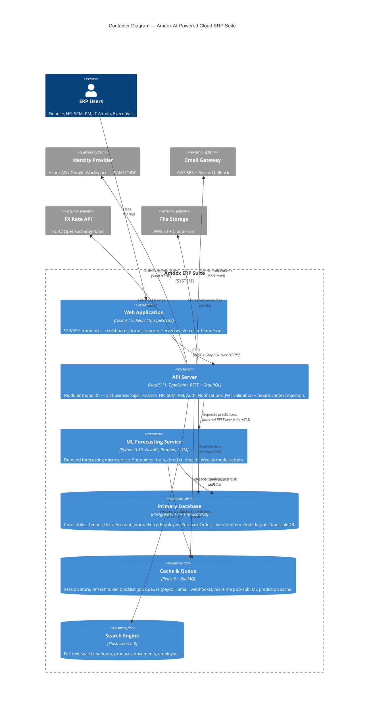

# C4 Container Diagram — Amdox AI-Powered Cloud ERP Suite

## How to use
1. Copy the code block below
2. Paste into **mermaid.live** (browser) or GitHub `.md` file or Notion `/mermaid` block
3. Diagram renders automatically

## What this diagram shows

### Inside the ERP box (6 containers):

1. **Web Application (Next.js 15)**
   - The frontend users interact with — renders pages server-side for fast load
   - Talks ONLY to the API server, never directly to the DB

2. **API Server (NestJS 11)**
   - The brain — ALL business logic lives here (Finance, HR, SCM, Auth, Notifications)
   - "Modular monolith" = one deployable unit but internally organized by domain modules
   - Handles JWT validation, tenant context injection, RBAC

3. **ML Forecasting Service (Python FastAPI)**
   - Separate microservice — only does demand forecasting
   - Communicates with API server over internal REST (Istio mTLS for zero-trust)
   - Reads training data from PostgreSQL, caches predictions in Redis

4. **Primary Database (PostgreSQL 17 + TimescaleDB)**
   - Single source of truth for all transactional data
   - TimescaleDB extension handles time-series audit logs + telemetry

5. **Cache & Queue (Redis 8 + BullMQ)**
   - Multi-purpose: session store, job queues (payroll batch, emails), pub/sub, prediction cache
   - BullMQ = Redis-backed queue for async jobs with retry/dead-letter support

6. **Search Engine (Elasticsearch 8)**
   - Full-text search across vendors, products, documents
   - Kept separate from PostgreSQL because SQL LIKE queries don't scale for search UX

### Outside the box (external systems):
- Same 4 external dependencies from the Context diagram (IdP, Email, FX, S3)

## Key architecture decisions visible here:
- Frontend NEVER talks directly to DB — always through API (security boundary)
- ML service is the ONLY microservice — everything else is modular monolith (keeps complexity manageable for 28-day timeline)
- Redis does triple duty (sessions + queues + cache) — single dependency, simpler ops
- All internal service-to-service traffic goes through Istio mTLS (zero-trust networking)

## Next level
- **C4 Component** — zoom INTO the API Server box → shows individual domain modules (Finance, HR, SCM, Auth, Notification)
