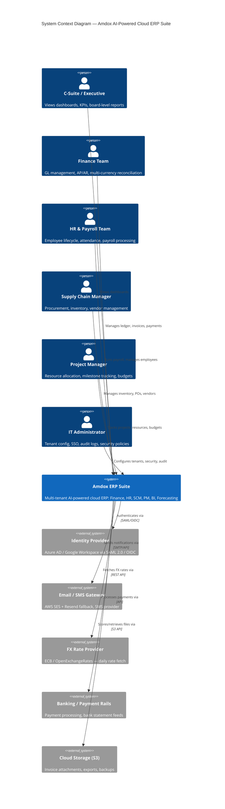

# C4 Context Diagram — Amdox AI-Powered Cloud ERP Suite

## How to use
1. Copy the code block below
2. Paste into **mermaid.live** (browser) or GitHub `.md` file or Notion `/mermaid` block
3. Diagram renders automatically — no manual drawing needed

## What this diagram shows

**Users (left side) — WHO uses the system:**
- 6 user types from the Amdox ERP doc (Section 1.2)

**System (center) — WHAT we are building:**
- The entire Amdox ERP as one single box (Context level = no internal detail)

**External Systems (right side) — WHAT it depends on:**
- Identity Provider (Keycloak/Azure AD/Google) for SSO
- Email/SMS gateway for notifications
- FX rate API for multi-currency support
- Banking rails for payment processing
- S3 for file storage

## Next levels (to be created)
- **C4 Container** — zoom INTO the ERP box → shows web app, API, ML service, databases
- **C4 Component** — zoom INTO one container (e.g. API) → shows modules like Finance, HR, SCM
