# Database ERD — Amdox AI-Powered Cloud ERP Suite

## How to use
1. Copy the code block below
2. Paste into **mermaid.live** or GitHub `.md` or Notion `/mermaid`

```mermaid
---
config:
  theme: base
  themeVariables:
    fontSize: 13px
---

erDiagram

    %% =============================
    %% MULTI-TENANCY & AUTH
    %% =============================

    Tenant {
        uuid id PK
        string name
        string slug UK "URL-safe unique slug"
        string plan "free | pro | enterprise"
        jsonb settings "tenant-level config"
        boolean isActive
        timestamp createdAt
        timestamp updatedAt
        timestamp deletedAt "soft-delete"
    }

    User {
        uuid id PK
        uuid tenantId FK "row-level security filter"
        string email UK
        string firstName
        string lastName
        string keycloakId UK "external IdP reference"
        string mfaMethod "totp | sms | none"
        boolean isActive
        timestamp lastLoginAt
        timestamp createdAt
        timestamp updatedAt
        timestamp deletedAt
    }

    Role {
        uuid id PK
        uuid tenantId FK
        string name "SuperAdmin | TenantAdmin | Manager | Viewer"
        jsonb permissions "granular permission set"
        timestamp createdAt
        timestamp updatedAt
    }

    UserRole {
        uuid id PK
        uuid userId FK
        uuid roleId FK
        uuid tenantId FK
        timestamp assignedAt
    }

    %% =============================
    %% FINANCE — GL, AP, AR
    %% =============================

    Account {
        uuid id PK
        uuid tenantId FK
        string code UK "e.g. 1000, 2000, 3000"
        string name "Cash, Accounts Receivable, etc"
        string type "asset | liability | equity | revenue | expense"
        string subType "current_asset | fixed_asset | etc"
        boolean isActive
        uuid parentId FK "for hierarchical chart of accounts"
        timestamp createdAt
        timestamp updatedAt
        timestamp deletedAt
    }

    JournalEntry {
        uuid id PK
        uuid tenantId FK
        string entryNumber UK "auto-generated sequence"
        date entryDate
        string description
        string status "draft | posted | reversed"
        uuid periodId FK
        string currency "ISO 4217 code"
        decimal exchangeRate "FX rate at posting time"
        uuid createdById FK "User who created"
        uuid approvedById FK "User who approved"
        timestamp postedAt
        timestamp createdAt
        timestamp updatedAt
    }

    JournalLine {
        uuid id PK
        uuid journalEntryId FK
        uuid accountId FK
        uuid tenantId FK
        decimal debitAmount "zero if credit line"
        decimal creditAmount "zero if debit line"
        string memo
        integer lineOrder
    }

    FiscalPeriod {
        uuid id PK
        uuid tenantId FK
        string name "e.g. Jan 2026, Q1 2026"
        date startDate
        date endDate
        boolean isLocked "period close flag"
        uuid lockedById FK "who locked it"
        timestamp lockedAt
        timestamp createdAt
    }

    Invoice {
        uuid id PK
        uuid tenantId FK
        string invoiceNumber UK
        string direction "payable | receivable"
        uuid vendorId FK "null if receivable"
        uuid customerId FK "null if payable"
        decimal amount
        string currency
        decimal exchangeRate
        string status "draft | pending | approved | paid | overdue"
        date issueDate
        date dueDate
        uuid purchaseOrderId FK "for 3-way matching"
        uuid goodsReceiptId FK "for 3-way matching"
        string ocrRawData "OCR extraction result"
        timestamp createdAt
        timestamp updatedAt
        timestamp deletedAt
    }

    Payment {
        uuid id PK
        uuid tenantId FK
        uuid invoiceId FK
        decimal amount
        string currency
        string method "bank_transfer | cheque | card"
        date paymentDate
        string reference "bank reference number"
        timestamp createdAt
    }

    %% =============================
    %% HR & PAYROLL
    %% =============================

    Employee {
        uuid id PK
        uuid tenantId FK
        uuid userId FK "linked login account (nullable)"
        string employeeCode UK
        string firstName
        string lastName
        string email
        string phone
        date dateOfBirth
        date hireDate
        date terminationDate "null if active"
        uuid departmentId FK
        uuid managerId FK "self-ref for org chart"
        string employmentType "full_time | part_time | contract"
        string status "active | on_leave | terminated"
        jsonb bankDetails "encrypted at rest"
        timestamp createdAt
        timestamp updatedAt
        timestamp deletedAt
    }

    Department {
        uuid id PK
        uuid tenantId FK
        string name
        string code
        uuid headId FK "department head (Employee)"
        uuid parentId FK "for org hierarchy"
        timestamp createdAt
        timestamp updatedAt
    }

    LeaveRequest {
        uuid id PK
        uuid tenantId FK
        uuid employeeId FK
        string leaveType "annual | sick | maternity | etc"
        date startDate
        date endDate
        decimal days
        string status "pending | approved | rejected | cancelled"
        uuid approvedById FK
        string reason
        timestamp createdAt
        timestamp updatedAt
    }

    Attendance {
        uuid id PK
        uuid tenantId FK
        uuid employeeId FK
        date workDate
        timestamp clockIn
        timestamp clockOut
        decimal hoursWorked
        decimal overtimeHours
        string source "manual | biometric | api"
        timestamp createdAt
    }

    PayrollRun {
        uuid id PK
        uuid tenantId FK
        string period "e.g. 2026-04"
        string status "draft | processing | completed | failed"
        date runDate
        integer employeeCount
        decimal totalGross
        decimal totalDeductions
        decimal totalNet
        uuid initiatedById FK
        string jobId "BullMQ job reference"
        timestamp completedAt
        timestamp createdAt
    }

    Payslip {
        uuid id PK
        uuid tenantId FK
        uuid payrollRunId FK
        uuid employeeId FK
        decimal grossSalary
        jsonb deductions "tax, PF, ESI, etc — region-specific"
        jsonb earnings "base, HRA, bonus, etc"
        decimal netSalary
        string pdfUrl "S3 path to generated payslip"
        timestamp createdAt
    }

    %% =============================
    %% SUPPLY CHAIN & INVENTORY
    %% =============================

    Vendor {
        uuid id PK
        uuid tenantId FK
        string name
        string code UK
        string email
        string phone
        jsonb address
        string status "active | inactive | blacklisted"
        string paymentTerms "net_30 | net_60 | etc"
        decimal rating "performance score"
        timestamp createdAt
        timestamp updatedAt
        timestamp deletedAt
    }

    PurchaseOrder {
        uuid id PK
        uuid tenantId FK
        string poNumber UK
        uuid vendorId FK
        string status "draft | submitted | approved | received | cancelled"
        decimal totalAmount
        string currency
        date orderDate
        date expectedDeliveryDate
        uuid createdById FK
        uuid approvedById FK
        timestamp createdAt
        timestamp updatedAt
    }

    PurchaseOrderLine {
        uuid id PK
        uuid purchaseOrderId FK
        uuid inventoryItemId FK
        decimal quantity
        decimal unitPrice
        decimal lineTotal
        integer lineOrder
    }

    GoodsReceipt {
        uuid id PK
        uuid tenantId FK
        uuid purchaseOrderId FK
        date receiptDate
        string status "partial | complete"
        uuid receivedById FK
        string notes
        timestamp createdAt
    }

    InventoryItem {
        uuid id PK
        uuid tenantId FK
        string sku UK
        string name
        string description
        string category
        string unit "pcs | kg | litre | etc"
        decimal currentStock
        decimal reorderPoint "auto-PO trigger threshold"
        decimal reorderQuantity
        string costingMethod "FIFO | weighted_avg"
        decimal unitCost
        uuid warehouseId FK
        timestamp createdAt
        timestamp updatedAt
        timestamp deletedAt
    }

    Warehouse {
        uuid id PK
        uuid tenantId FK
        string name
        string code
        jsonb address
        boolean isActive
        timestamp createdAt
        timestamp updatedAt
    }

    %% =============================
    %% NOTIFICATIONS & AUDIT
    %% =============================

    Notification {
        uuid id PK
        uuid tenantId FK
        uuid userId FK "recipient"
        string channel "in_app | email | sms | webhook"
        string eventType "invoice.approved | po.created | etc"
        string title
        text body
        string status "queued | sent | failed | read"
        integer retryCount "max 3"
        string jobId "BullMQ reference"
        timestamp sentAt
        timestamp readAt
        timestamp createdAt
    }

    AuditLog {
        uuid id PK
        uuid tenantId FK
        uuid userId FK "who performed the action"
        string entity "Invoice | Employee | PurchaseOrder | etc"
        uuid entityId "which record"
        string action "create | update | delete | approve"
        jsonb previousValue "snapshot before change"
        jsonb newValue "snapshot after change"
        string ipAddress
        string userAgent
        string hashChain "SHA-256 hash of previous log — tamper detection"
        timestamp createdAt "append-only — no updatedAt"
    }

    %% =============================
    %% RELATIONSHIPS
    %% =============================

    %% Auth
    Tenant ||--o{ User : "has many"
    Tenant ||--o{ Role : "has many"
    User ||--o{ UserRole : "assigned"
    Role ||--o{ UserRole : "assigned to"

    %% Finance
    Tenant ||--o{ Account : "has many"
    Tenant ||--o{ FiscalPeriod : "has many"
    Account ||--o{ JournalLine : "referenced in"
    Account ||--o{ Account : "parent-child"
    JournalEntry ||--o{ JournalLine : "contains"
    JournalEntry }o--|| FiscalPeriod : "belongs to"
    JournalEntry }o--|| User : "created by"
    Invoice }o--o| PurchaseOrder : "3-way match"
    Invoice }o--o| GoodsReceipt : "3-way match"
    Invoice ||--o{ Payment : "paid via"
    Invoice }o--o| Vendor : "payable to"

    %% HR
    Tenant ||--o{ Department : "has many"
    Department ||--o{ Employee : "contains"
    Employee ||--o{ Employee : "reports to (manager)"
    Employee ||--o{ LeaveRequest : "requests"
    Employee ||--o{ Attendance : "records"
    Employee ||--o{ Payslip : "receives"
    PayrollRun ||--o{ Payslip : "generates"
    Employee }o--o| User : "linked login"

    %% Supply Chain
    Tenant ||--o{ Vendor : "has many"
    Tenant ||--o{ Warehouse : "has many"
    Vendor ||--o{ PurchaseOrder : "receives"
    PurchaseOrder ||--o{ PurchaseOrderLine : "contains"
    PurchaseOrderLine }o--|| InventoryItem : "for item"
    PurchaseOrder ||--o{ GoodsReceipt : "fulfilled by"
    Warehouse ||--o{ InventoryItem : "stores"

    %% Cross-cutting
    Tenant ||--o{ Notification : "has many"
    User ||--o{ Notification : "receives"
    Tenant ||--o{ AuditLog : "has many"
    User ||--o{ AuditLog : "performed by"
```

## Entity Count Summary

| Bounded Context | Tables | Entities |
|---|---|---|
| Auth & Tenancy | 4 | Tenant, User, Role, UserRole |
| Finance (GL/AP/AR) | 6 | Account, JournalEntry, JournalLine, FiscalPeriod, Invoice, Payment |
| HR & Payroll | 6 | Employee, Department, LeaveRequest, Attendance, PayrollRun, Payslip |
| Supply Chain | 6 | Vendor, PurchaseOrder, PurchaseOrderLine, GoodsReceipt, InventoryItem, Warehouse |
| Cross-cutting | 2 | Notification, AuditLog |
| **Total** | **24** | |

## Key Design Decisions

### 1. tenantId on EVERY table
Row-level security — every query filtered by tenantId at the Prisma middleware layer. No cross-tenant data leakage possible.

### 2. Soft-delete (deletedAt)
Most entities use `deletedAt` instead of hard delete — required for GDPR audit trail and data recovery. Prisma middleware auto-filters soft-deleted records.

### 3. UUID primary keys (not auto-increment)
Prevents tenant data leakage via sequential ID guessing (IDOR vulnerability). Also makes future DB sharding easier.

### 4. JournalEntry + JournalLine (double-entry)
Enforces accounting invariant: SUM(debits) = SUM(credits) per JournalEntry. Validated at the application layer before posting.

### 5. 3-way matching (Invoice ↔ PO ↔ GoodsReceipt)
Invoice links to both PurchaseOrder and GoodsReceipt — enables automated AP approval when all three match.

### 6. AuditLog with hashChain
Each audit record stores SHA-256 hash of the previous record — tamper-evident chain. If any record is modified, the chain breaks and is detectable.

### 7. PayrollRun as a batch entity
Payroll runs as a batch job (BullMQ reference stored) — not real-time. Supports saga pattern: if any step fails, compensating transactions roll back partial calculations.

## Indexes to create (Day 5 task)
- `(tenantId)` on every table — partition key for RLS
- `(tenantId, email)` on User — unique login lookup
- `(tenantId, sku)` on InventoryItem — stock queries
- `(tenantId, entryDate)` on JournalEntry — period queries
- `(tenantId, status)` on Invoice, PurchaseOrder — workflow filters
- `(tenantId, employeeId, workDate)` on Attendance — daily lookup
- `(tenantId, createdAt)` on AuditLog — time-range queries (TimescaleDB hypertable)
