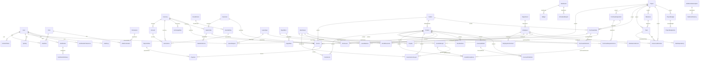

# Database ERD — Amdox AI-Powered Cloud ERP Suite

> **Generated file — do not edit by hand.** Regenerate after any schema change with
> `node scripts/generate-erd.mjs` (source of truth: `packages/db/prisma/schema.prisma`).
>
> Current schema: **67 models**, 77 relations, PostgreSQL 17 + Prisma.
> Every model carries `tenantId` (multi-tenant row scoping); those edges are omitted below for readability.
> `docs/erd/schema.prisma` is a synced copy of the live schema for field-level detail.

## Full ERD image

(`database-erd.svg` is the vector version; `database-erd.dot` is the Graphviz source.)

## Relationship diagram (mermaid)

Entity-to-entity relations grouped by domain. `A ||--o{ B : "field"` reads
“one A has many B, via B’s `field` foreign key.” Paste into mermaid.live or view on GitHub.

```mermaid
erDiagram

    %% ---------- Tenancy & Auth ----------
    User ||--o{ UserRole : "user"
    Role ||--o{ UserRole : "role"
    Role ||--o{ RolePermission : "role"
    Permission ||--o{ RolePermission : "permission"
    User ||--o{ RefreshToken : "user"
    User ||--o{ ApiKey : "user"

    %% ---------- Finance ----------
    Currency ||--o{ Account : "currency"
    FiscalPeriod ||--o{ JournalEntry : "fiscalPeriod"
    JournalEntry ||--o{ JournalLine : "journalEntry"
    Account ||--o{ JournalLine : "account"
    Currency ||--o{ JournalLine : "currency"
    Currency ||--o{ ExchangeRate : "toCurrency"
    Customer ||--o{ SalesOrder : "customer"
    Currency ||--o{ SalesOrder : "currency"
    SalesOrder ||--o{ SalesOrderLine : "salesOrder"
    Vendor ||--o{ Invoice : "vendor"
    Customer ||--o{ Invoice : "customer"
    PurchaseOrder ||--o{ Invoice : "purchaseOrder"
    SalesOrder ||--o{ Invoice : "salesOrder"
    Project ||--o{ Invoice : "project"
    Currency ||--o{ Invoice : "currency"
    Invoice ||--o{ InvoiceLine : "invoice"
    Product ||--o{ InvoiceLine : "product"
    Invoice ||--o{ Payment : "invoice"
    PaymentRun ||--o{ Payment : "paymentRun"

    %% ---------- HR & Payroll ----------
    Department ||--o{ Employee : "department"
    Employee ||--o{ EmploymentContract : "employee"
    Employee ||--o{ LeaveRequest : "employee"
    LeaveType ||--o{ LeaveRequest : "leaveType"
    User ||--o{ LeaveRequest : "requestedBy"
    Employee ||--o{ LeaveBalance : "employee"
    LeaveType ||--o{ LeaveBalance : "leaveType"
    Employee ||--o{ AttendanceRecord : "employee"
    PayrollRun ||--o{ Payslip : "payrollRun"
    Employee ||--o{ Payslip : "employee"

    %% ---------- Supply Chain & Inventory ----------
    Vendor ||--o{ Product : "defaultVendor"
    Project ||--o{ PurchaseRequisition : "project"
    PurchaseRequisition ||--o{ PurchaseRequisitionLine : "requisition"
    Product ||--o{ PurchaseRequisitionLine : "product"
    Vendor ||--o{ PurchaseOrder : "vendor"
    PurchaseRequisition ||--o{ PurchaseOrder : "requisition"
    Project ||--o{ PurchaseOrder : "project"
    PurchaseOrder ||--o{ PurchaseOrderLine : "purchaseOrder"
    Product ||--o{ PurchaseOrderLine : "product"
    PurchaseOrder ||--o{ GoodsReceipt : "purchaseOrder"
    Warehouse ||--o{ GoodsReceipt : "warehouse"
    GoodsReceipt ||--o{ GoodsReceiptLine : "goodsReceipt"
    PurchaseOrderLine ||--o{ GoodsReceiptLine : "purchaseOrderLine"
    Product ||--o{ GoodsReceiptLine : "product"
    Product ||--o{ InventoryCostLayer : "product"
    Warehouse ||--o{ InventoryCostLayer : "warehouse"
    GoodsReceipt ||--o{ InventoryCostLayer : "goodsReceipt"
    Product ||--o{ StockLevel : "product"
    Warehouse ||--o{ StockLevel : "warehouse"
    Product ||--o{ StockMovement : "product"
    Warehouse ||--o{ StockMovement : "warehouse"
    Product ||--o{ ReorderRule : "product"

    %% ---------- AI Forecasting ----------
    Product ||--o{ ForecastModel : "product"
    ForecastModel ||--o{ ForecastPrediction : "forecastModel"
    Product ||--o{ ForecastPrediction : "product"

    %% ---------- Project Management ----------
    Project ||--o{ Task : "project"
    Milestone ||--o{ Task : "milestone"
    Task ||--o{ TaskDependency : "prerequisiteTask"
    Project ||--o{ Milestone : "project"
    Project ||--o{ ResourceAllocation : "project"
    Task ||--o{ ResourceAllocation : "task"
    Employee ||--o{ ResourceAllocation : "employee"
    Project ||--o{ ProjectBudget : "project"
    ProjectBudget ||--o{ ProjectBudgetLine : "projectBudget"

    %% ---------- Business Intelligence ----------
    Dashboard ||--o{ Widget : "dashboard"
    Dashboard ||--o{ ScheduledReport : "dashboard"

    %% ---------- Notifications & Webhooks ----------
    User ||--o{ Notification : "user"
    User ||--o{ NotificationPreference : "user"
    Notification ||--o{ NotificationDelivery : "notification"
    WebhookSubscription ||--o{ WebhookDelivery : "subscription"

    %% ---------- Audit & Compliance ----------
    User ||--o{ AuditLog : "user"

    %% ---------- Eventing & Sagas ----------
    PayrollRun ||--o{ SagaState : "payrollRun"
```
