# Amdox ERP — Frontend Architecture

This document reflects the **current, live** frontend architecture as implemented in `apps/web/src`.
Last updated: July 2026.

---

## System Architecture Diagram

```mermaid
graph LR
    Browser["🌐 Browser\nNext.js 15 App Router"]

    subgraph AUTH["🔐 Auth Layer"]
        direction TB
        KC_JS[keycloak-js SDK\ncheck-sso on load]
        KC_CTX[KeycloakProvider\nReact Context]
        API_CLIENT[apiClient\nBearer token injection\nauto-refresh 30s]
        KC_JS --> KC_CTX
        KC_CTX --> API_CLIENT
    end

    subgraph LAYOUT["📐 App Shell (layout.tsx)"]
        direction TB
        ROOT_LAYOUT[Root Layout\nfont · global CSS · providers]
        DASH_LAYOUT[Dashboard Layout\nSidebar + top nav]
        ROOT_LAYOUT --> DASH_LAYOUT
    end

    subgraph PAGES["📄 Pages (App Router)"]
        direction TB

        subgraph SCM_MOD["📦 /scm"]
            direction TB
            SCM_LAYOUT[scm/layout.tsx\nTabs · KPI bar]
            SCM_VEND["vendors/page.tsx\nShows: Supplier database\nUse: Add/edit vendors\nWhy: Required before raising POs"]
            SCM_PO["purchase-orders/page.tsx\nShows: Procurement orders\nUse: Create & approve POs\nWhy: Tracks ordered goods/services"]
            SCM_GR["goods-receipt/page.tsx\nShows: Pending/received deliveries\nUse: Mark items as received\nWhy: Triggers AP invoice creation"]
            SCM_INV["inventory/page.tsx\nShows: Stock levels & warehouses\nUse: Monitor stock & reorder rules\nWhy: Prevents stockouts"]
            SCM_LAYOUT --> SCM_VEND & SCM_PO & SCM_GR & SCM_INV
        end

        subgraph FIN_MOD["💰 /finance"]
            direction TB
            FIN_LAYOUT[finance/layout.tsx\nTabs · KPI bar]
            FIN_COA["accounts/page.tsx\nShows: Chart of Accounts\nUse: View GL account balances\nWhy: Foundation for double-entry"]
            FIN_GL["journal-entries/page.tsx\nShows: Double-entry logs\nUse: Create/review draft entries\nWhy: Keeps books balanced"]
            FIN_AP["invoices/page.tsx\nShows: Vendor invoices\nUse: Manual approve on match failure\nWhy: Manages Accounts Payable"]
            FIN_AR["aging-report/page.tsx\nShows: Overdue customer invoices\nUse: Identify collection priorities\nWhy: Crucial for cash flow"]
            FIN_LAYOUT --> FIN_COA & FIN_GL & FIN_AP & FIN_AR
        end

        subgraph HR_MOD["👥 /hr"]
            direction TB
            HR_EMP["employees/page.tsx\nShows: Staff directory\nUse: Manage employee lifecycle\nWhy: Core HR data source"]
            HR_LEAVE["leave-requests/page.tsx\nShows: Time-off requests\nUse: Approve/reject leave\nWhy: Tracks resource availability"]
            HR_ATT["attendance/page.tsx\nShows: Clock-in/out logs\nUse: Track hours & overtime\nWhy: Required for payroll runs"]
            HR_PAY["payroll/page.tsx\nShows: Salary processing\nUse: Run monthly payroll\nWhy: Pays employees & posts to GL"]
        end

        subgraph PM_MOD["🗂️ /projects"]
            direction TB
            PM_LAYOUT[projects/layout.tsx\nTabs · KPI bar]
            PM_OVW["overview/page.tsx\nShows: Project portfolio\nUse: Track health & status\nWhy: High-level executive view"]
            PM_TASKS["tasks/page.tsx\nShows: Task breakdown\nUse: Assign work & track progress\nWhy: Ensures timely delivery"]
            PM_RES["resources/page.tsx\nShows: Team allocation\nUse: Assign people to tasks\nWhy: Prevents burnout/underutilization"]
            PM_BUDG["budget/page.tsx\nShows: Budget vs Actuals\nUse: Monitor project spend\nWhy: Prevents cost overruns"]
            PM_NEW["new/page.tsx\nShows: Creation form\nUse: Setup new projects\nWhy: Entry point for PM flow"]
            PM_LAYOUT --> PM_OVW & PM_TASKS & PM_RES & PM_BUDG & PM_NEW
        end
    end

    subgraph UI_LIB["🎨 Shared UI Component Library\n/components/ui"]
        direction TB
        BTN[Button]
        BADGE[Badge\n+ statusToTone]
        DT[DataTable\n+ ColumnDef]
        SC[StatCard]
        MOD[Modal]
        TBL[Table · THead · TH\nTBody · TR · TD · EmptyState]
    end

    subgraph API_LAYER["🔌 API Layer\n/lib/api"]
        direction TB
        CLIENT[client.ts\nfetch wrapper\nauto token refresh]
        SCM_API[scm-api.ts\nVendor · Purchase · Inventory]
        FIN_API[finance-api.ts\nAP invoices · approve]
        HR_API[hr-api.ts\nEmployee · Leave · Payroll]
    end

    BACKEND["⚙️ NestJS API\nlocalhost:3001"]

    %% ── Browser boots ─────────────────────────────
    Browser -->|"Next.js hydrates\ncheck-sso (non-blocking)"| KC_JS
    Browser -->|"renders shell"| ROOT_LAYOUT

    %% ── Layout wrapping (Next.js file-system routing)
    DASH_LAYOUT -->|"wraps all /dashboard/** pages"| SCM_MOD & FIN_MOD & HR_MOD & PM_MOD

    %% ── Pages use UI components ────────────────────
    SCM_MOD & FIN_MOD & HR_MOD & PM_MOD -->|"import shared UI primitives"| UI_LIB

    %% ── Pages call API layer ───────────────────────
    SCM_MOD -->|"scmApi.getVendors()\nscmApi.createPurchaseOrder()\nscmApi.receiveGoods()"| SCM_API
    FIN_MOD -->|"financeApi.getInvoices()\nfinanceApi.approveInvoice()"| FIN_API
    HR_MOD  -->|"hrApi.getEmployees()\nhrApi.approveLeave()\nhrApi.runPayroll()"| HR_API

    %% ── API layer attaches token and hits backend ──
    SCM_API & FIN_API & HR_API -->|"calls apiClient(endpoint, options)"| CLIENT
    CLIENT -->|"GET/POST/PATCH/DELETE\nAuthorization: Bearer <JWT>\nContent-Type: application/json"| BACKEND

    %% ── Token auto-refresh ─────────────────────────
    KC_CTX -.->|"updateToken(30s)\nif expired → keycloak.login()"| CLIENT

    %% ── Style ─────────────────────────────────────
    classDef pageStyle  fill:#1E3A5F,stroke:#0f2540,color:#fff;
    classDef uiStyle    fill:#2F6B4F,stroke:#1d4332,color:#fff;
    classDef apiStyle   fill:#7B61D4,stroke:#5a46a8,color:#fff;
    classDef authStyle  fill:#B4533B,stroke:#8a3d2b,color:#fff;
    classDef layoutStyle fill:#D9A85C,stroke:#a07030,color:#14171F;
    classDef backendStyle fill:#14171F,stroke:#0a0d12,color:#fff;

    class SCM_VEND,SCM_PO,SCM_GR,SCM_INV,FIN_COA,FIN_GL,FIN_AP,FIN_AR,HR_EMP,HR_LEAVE,HR_ATT,HR_PAY,PM_OVW,PM_TASKS,PM_RES,PM_BUDG,PM_NEW pageStyle;
    class BTN,BADGE,DT,SC,MOD,TBL uiStyle;
    class CLIENT,SCM_API,FIN_API,HR_API apiStyle;
    class KC_JS,KC_CTX,API_CLIENT authStyle;
    class ROOT_LAYOUT,DASH_LAYOUT,SCM_LAYOUT,FIN_LAYOUT,PM_LAYOUT layoutStyle;
    class BACKEND backendStyle;
```



---

## Reading the Diagram

### Arrow Types

| Arrow                        | Meaning                              | When it happens                                                    |
| ---------------------------- | ------------------------------------ | ------------------------------------------------------------------ |
| **Solid `-->`**              | Direct dependency / synchronous call | Component mounts, function is called, response is awaited          |
| **Dashed `-.->` with label** | Async / background behaviour         | Not triggered by user action — happens automatically in background |

---

### Every Connection Explained

#### 🌐 Browser Startup

| Connection                          | What is actually happening                                                                                                                                                                                                                                                                                                                                   |
| ----------------------------------- | ------------------------------------------------------------------------------------------------------------------------------------------------------------------------------------------------------------------------------------------------------------------------------------------------------------------------------------------------------------ |
| `Browser → keycloak-js (check-sso)` | When the app loads, `KeycloakProvider` calls `keycloak.init({ onLoad: 'check-sso' })`. This silently checks if there is an active Keycloak session using an iframe. If yes → user is treated as authenticated. If no → the landing page still loads (it is public). The user only gets redirected to Keycloak login if they try to access a protected route. |
| `Browser → Root Layout`             | Next.js renders the root `layout.tsx` which wraps the whole app. It sets up global fonts, the CSS design tokens, and mounts the `KeycloakProvider` so all child components can access auth state.                                                                                                                                                            |

---

#### 📐 Layout Wrapping (Next.js File-System Routing)

Next.js automatically wraps every page with all the `layout.tsx` files above it in the folder tree.

| Layout File                  | What it wraps            | What it adds                                                   |
| ---------------------------- | ------------------------ | -------------------------------------------------------------- |
| `app/layout.tsx`             | Every page in the app    | Global CSS, fonts (IBM Plex Sans), `KeycloakProvider`          |
| `app/(dashboard)/layout.tsx` | Every module page        | Sidebar navigation, top bar                                    |
| `scm/layout.tsx`             | All `/scm/**` pages      | Tab bar (Inventory · POs · Goods Receipt · Invoices) + KPI row |
| `finance/layout.tsx`         | All `/finance/**` pages  | Tab bar (Chart of Accounts · GL · AP · Aging) + KPI row        |
| `projects/layout.tsx`        | All `/projects/**` pages | Tab bar (Overview · Tasks · Resources · Budget) + KPI row      |

> **Key rule**: A `layout.tsx` renders once and stays mounted as the user navigates between tabs — only `{children}` (the page) re-renders. This keeps the KPI cards and tab bar from flickering on tab switches.

---

#### 📄 Pages and the UI Component Library

| Connection           | What is actually happening                                                                                                                                                                                                                                                   |
| -------------------- | ---------------------------------------------------------------------------------------------------------------------------------------------------------------------------------------------------------------------------------------------------------------------------- |
| `Pages → UI Library` | Every page imports reusable primitives from `components/ui/`. Pages never write their own raw `<table>`, `<button>`, or `<span>` for common patterns — they always use the shared components. This ensures consistent spacing, colours, and hover states across all modules. |

**Available shared UI components:**

| Component                                                 | File             | What it does                                                                                       |
| --------------------------------------------------------- | ---------------- | -------------------------------------------------------------------------------------------------- |
| `Button`                                                  | `button.tsx`     | Primary, secondary, outline, ghost variants + icon slot                                            |
| `Badge` + `statusToTone`                                  | `badge.tsx`      | Coloured pill label. `statusToTone` maps backend status strings (e.g. `APPROVED`) to a colour tone |
| `DataTable` + `ColumnDef`                                 | `data-table.tsx` | Generic typed table. Pass `data`, `columns`, `keyExtractor`, `emptyMessage` — no boilerplate       |
| `StatCard`                                                | `stat-card.tsx`  | Gradient KPI metric card used in every module's header                                             |
| `Modal`                                                   | `modal.tsx`      | Overlay dialog for forms (create/edit/delete confirmation)                                         |
| `Table`, `THead`, `TH`, `TBody`, `TR`, `TD`, `EmptyState` | `table.tsx`      | Raw table primitives for custom layouts                                                            |

---

#### 🔌 API Layer — How Data Gets Fetched

The API layer sits between pages and the backend. Pages never call `fetch()` directly.

| Connection                       | What is actually happening                                                                                                                                                                                                                               |
| -------------------------------- | -------------------------------------------------------------------------------------------------------------------------------------------------------------------------------------------------------------------------------------------------------- |
| `SCM pages → scm-api.ts`         | SCM pages call typed functions like `scmApi.getVendors()`, `scmApi.createPurchaseOrder(body)`. These functions know the exact backend endpoint URLs. If the endpoint URL ever changes, only this file needs to be updated — no page code changes needed. |
| `Finance pages → finance-api.ts` | Finance pages call `financeApi.getInvoices()` and `financeApi.approveInvoice(id)`. The approve call internally sends `POST /finance/ap/invoices/:id/approve`.                                                                                            |
| `HR pages → hr-api.ts`           | HR pages call `hrApi.getEmployees()`, `hrApi.approveLeave(id)`, `hrApi.runPayroll(body)`.                                                                                                                                                                |
| `All API modules → client.ts`    | Every API module calls `apiClient(endpoint, options)`. This is the single shared `fetch` wrapper for the whole app.                                                                                                                                      |

---

#### 🔐 The `apiClient` — What happens on every request

`client.ts` does 4 things automatically on every single API call:

```
1. Check if there is a Keycloak token.
2. Call keycloak.updateToken(30) — if token expires in < 30 seconds, refresh it silently.
   If refresh fails (session expired) → call keycloak.login() to redirect to login page.
3. Attach "Authorization: Bearer <token>" header.
4. Attach "Content-Type: application/json" header.
5. Call fetch() with the constructed headers.
6. If response is not OK → parse error body and throw an Error.
7. If response is empty (204 No Content) → return {}.
```

This means **no page ever handles token expiry** — it is handled centrally in one place.

---

#### ⚡ Token Auto-Refresh (dashed arrow)

| Connection                        | What is actually happening                                                                                                                                                                                                                                                                                                                                                                                      |
| --------------------------------- | --------------------------------------------------------------------------------------------------------------------------------------------------------------------------------------------------------------------------------------------------------------------------------------------------------------------------------------------------------------------------------------------------------------- |
| `KeycloakProvider -.-> apiClient` | `KeycloakProvider` does not push tokens to `apiClient` — instead, `apiClient` reads from the `keycloak` singleton directly. The `keycloak.updateToken(30)` call in `apiClient` is what does the auto-refresh. If the refresh fails (user has been idle for too long and the Keycloak session on the server expired), `keycloak.login()` is called which redirects the user to the Keycloak login page and back. |

---

## Folder Structure Reference

```
apps/web/src/
│
├── app/
│   ├── layout.tsx                    ← Root layout: global styles, providers
│   └── (dashboard)/
│       ├── layout.tsx                ← Dashboard shell: sidebar + topbar
│       ├── home/                     ← Dashboard home page
│       ├── scm/
│       │   ├── layout.tsx            ← SCM tab bar + KPI row
│       │   ├── vendors/page.tsx
│       │   ├── purchase-orders/page.tsx
│       │   ├── goods-receipt/page.tsx
│       │   ├── inventory/page.tsx
│       │   └── invoices/page.tsx
│       ├── finance/
│       │   ├── layout.tsx            ← Finance tab bar + KPI row
│       │   ├── accounts/page.tsx     ← Chart of Accounts
│       │   ├── journal-entries/page.tsx
│       │   ├── invoices/page.tsx     ← AP Invoices (connected to backend)
│       │   └── aging-report/page.tsx
│       ├── hr/
│       │   ├── employees/page.tsx
│       │   ├── leave-requests/page.tsx
│       │   ├── attendance/page.tsx
│       │   └── payroll/page.tsx
│       ├── projects/
│       │   ├── layout.tsx            ← Projects tab bar + KPI row
│       │   ├── overview/page.tsx
│       │   ├── tasks/page.tsx
│       │   ├── resources/page.tsx
│       │   ├── budget/page.tsx
│       │   └── new/page.tsx
│       └── settings/
│
├── components/
│   ├── KeycloakProvider.tsx          ← Auth context + useKeycloak hook
│   ├── ui/
│   │   ├── button.tsx
│   │   ├── badge.tsx
│   │   ├── data-table.tsx
│   │   ├── stat-card.tsx
│   │   ├── modal.tsx
│   │   └── table.tsx
│   ├── dashboard/                    ← Dashboard-specific components
│   ├── layout/                       ← Sidebar, topbar
│   └── landing/                      ← Landing page components
│
├── lib/
│   ├── api/
│   │   ├── client.ts                 ← Shared fetch wrapper (token + error handling)
│   │   ├── scm-api.ts                ← SCM endpoint functions
│   │   ├── finance-api.ts            ← Finance endpoint functions
│   │   ├── hr-api.ts                 ← HR endpoint functions
│   │   └── contracts.ts              ← Shared request/response TypeScript types
│   ├── keycloak.ts                   ← Keycloak JS singleton instance
│   ├── current-user.ts               ← Helper to read current user from token
│   ├── types.ts                      ← Shared frontend TypeScript types
│   └── mock/                         ← Orphaned mock fixtures (no page imports these anymore)
│
├── stores/                           ← (reserved for Zustand/Jotai global state)
├── hooks/                            ← Custom React hooks
└── styles/                           ← Global CSS / design tokens
```

---

## Key Conventions

| Rule                                     | Why                                                                                                                                                                                    |
| ---------------------------------------- | -------------------------------------------------------------------------------------------------------------------------------------------------------------------------------------- |
| Every page file is `"use client"`        | Data fetching uses `useEffect` + `useState` — not React Server Components — because auth token is only available client-side.                                                          |
| Pages fetch data in `useEffect` on mount | Simple and predictable. All API calls go through `apiClient` which handles auth automatically.                                                                                         |
| No global state store yet                | `stores/` folder exists but is empty. Each page manages its own local state with `useState`. If cross-page state is needed in future, Zustand will be added here.                      |
| Mock data in `/lib/mock/`                | **Orphaned** — every dashboard screen now calls live APIs (see `docs/wiring-audit.md`); no page imports this folder. Kept only as reference fixtures; safe to delete.                  |
| `ColumnDef<T>` for all tables            | All tables use the typed `DataTable` component with `ColumnDef<T>[]`. This enforces type safety — if a backend response type changes, TypeScript will highlight every affected column. |
