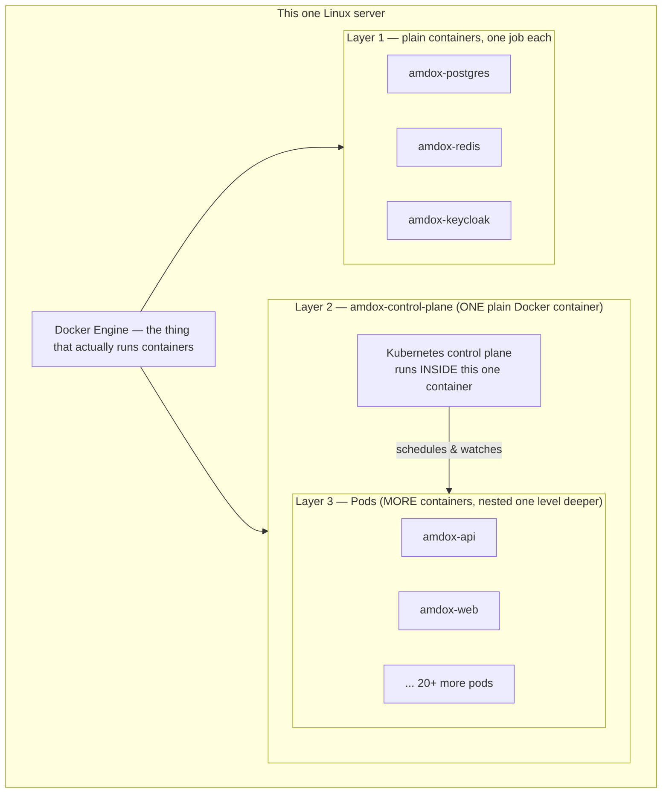
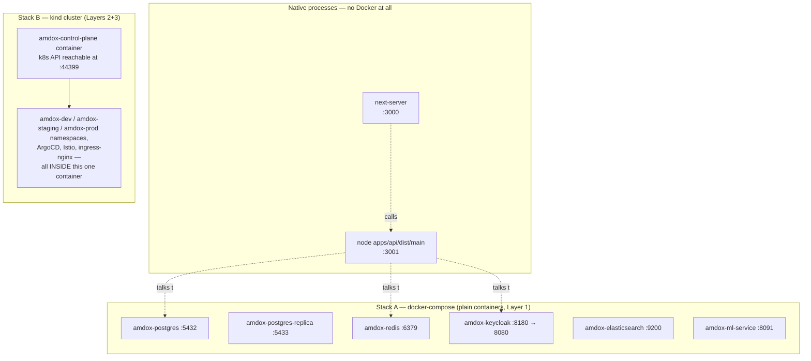
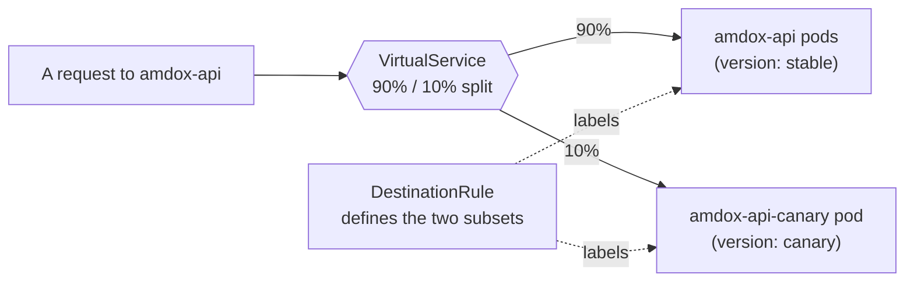
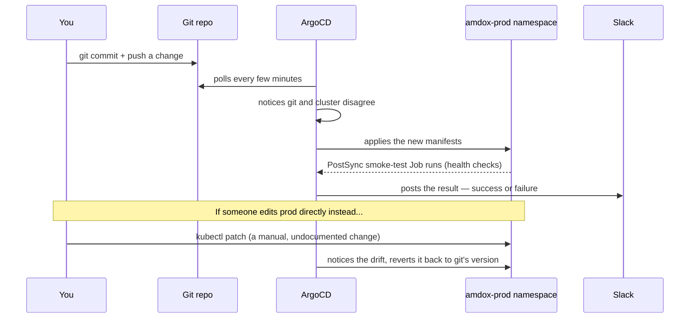
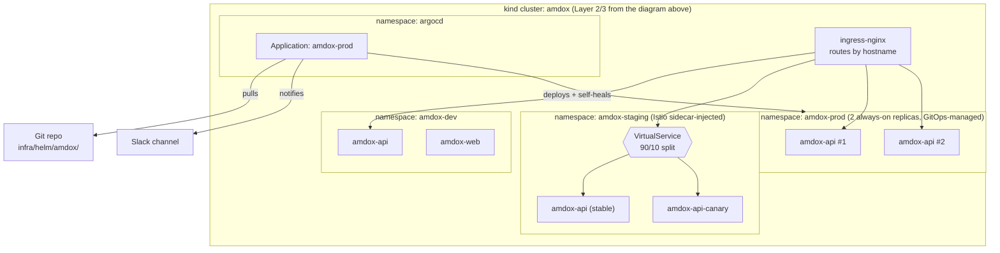

# Docker vs Kubernetes vs kind — Starting From Zero

This doc exists because of a very good question: _"what's actually running
on this server, and what's the difference between the kind cluster and
Docker?"_ The honest answer turned out to be "three layers, nested inside
each other" — which isn't obvious until you've seen it drawn out. This is
that drawing, plus everything needed to understand it, assuming no prior
Kubernetes/Docker background at all.

---

## 0. The absolute basics: process, port, server

Skip this section if these words are already familiar.

- A **process** is one running program. When you run `node server.js`,
  that's one process, with one process ID (PID), that the operating system
  tracks.
- A **port** is a numbered mailbox a process can claim on a machine, so
  network traffic knows which process to hand a message to. Port 5432 is
  "the Postgres mailbox," 3000 is "the web app mailbox." Only one process can
  hold a given port at a time on the same machine.
- A **server**, in this context, just means "a machine (or a stand-in for
  one) that keeps some process running and reachable over the network."

Everything below is really just answering: _how many processes are running,
where, and how do they find each other?_

---

## 1. Docker — one isolated program at a time

Before Docker, running "the database" and "the api" on the same machine
meant they shared one filesystem, one set of installed library versions, one
everything — a recipe for "works on my machine, breaks on yours."

**Docker's idea:** package a program together with its _entire_ filesystem —
libraries, config, everything it needs — into one file called an **image**.
Running that image creates a **container**: an isolated process that
believes it has the whole machine to itself, but is actually fenced off from
everything else on the host.

- `amdox-postgres`, `amdox-redis`, `amdox-keycloak` are each **one
  container** — one job, one image, started independently.
- Containers are cheap and fast to start (unlike a full virtual machine),
  because they share the host's Linux kernel — the isolation is a fence, not
  a separate operating system.

**What Docker alone does NOT do:** if `amdox-postgres` crashes, nothing
brings it back automatically. If you want 3 copies of the api for more
capacity, you start 3 containers by hand and remember to do it again next
time. There's no concept of "desired state" — only "what's running right
now, because someone started it."

**Docker Compose** is the next small step: one file (`docker-compose.yml`)
listing several containers and their connections, started together with one
command. That's exactly the 6-container stack we've been running
(`amdox-postgres`, `-redis`, `-keycloak`, `-elasticsearch`, `-ml-service`,
`-postgres-replica`) — simple, fast, great for local development, but still
just "containers someone started," with no self-healing or scaling built in.

---

## 2. The wall Docker hits

Imagine running _real_ production traffic. You'd want:

- If a container crashes, something notices and restarts it — automatically.
- If load spikes, more copies spin up on their own, and shrink back down later.
- A rolling change from version 1 to version 2 with zero downtime, and an
  easy way to send only 10% of traffic to the new version first.
- Many machines ("nodes") pooled together, with workloads spread across
  them, so one server dying doesn't take everything down.
- A single declarative description — "I want this many copies of this,
  configured this way" — that something else continuously enforces, rather
  than you running commands by hand every time reality drifts.

Docker Compose doesn't do any of this. This is the gap **Kubernetes** fills.

---

## 3. Kubernetes — an autopilot for containers

Kubernetes (often "k8s") is software that manages a pool of machines and
constantly asks: _"does what's running match what was asked for? If not,
fix it."_ You describe the destination; Kubernetes drives.

Here are the pieces we actually built, in plain language, each mapped to a
real file in `infra/helm/amdox/templates/`:

| Concept                             | Plain-language meaning                                                                            | Where we used it                             |
| ----------------------------------- | ------------------------------------------------------------------------------------------------- | -------------------------------------------- |
| **Pod**                             | The smallest unit Kubernetes runs — one or more containers that always live/die together          | every running api/web/ml container           |
| **Deployment**                      | "Keep N copies of this pod running, forever, and roll out changes safely"                         | `api-deployment.yaml`, `web-deployment.yaml` |
| **Service**                         | A stable internal address/name for a group of pods, even as individual pods come and go           | `api-service.yaml`                           |
| **Namespace**                       | A labeled folder inside the cluster — things in one folder can't see another's same-named objects | `amdox-dev` / `amdox-staging` / `amdox-prod` |
| **ConfigMap**                       | Plain-text configuration, injected into pods as environment variables                             | `api-configmap.yaml`                         |
| **Secret**                          | Same idea as ConfigMap, but for sensitive values (passwords, keys)                                | `api-secret.yaml`                            |
| **Ingress**                         | The "front door" — routes external traffic to the right Service based on the hostname requested   | `ingress.yaml`                               |
| **HPA** (Horizontal Pod Autoscaler) | "Add more pods automatically when CPU gets high, remove them when it drops"                       | `hpa.yaml`                                   |
| **PDB** (Pod Disruption Budget)     | "Never let voluntary maintenance (like a node drain) take down more than N pods at once"          | `pdb.yaml`                                   |

None of this requires a physical server per machine — Kubernetes runs on
however many machines ("nodes") you point it at, real or virtual.

---

## 4. kind — Kubernetes, without needing real servers

Here's the actual problem this project had: Kubernetes wants a pool of
machines to manage. We don't have a cloud account or spare physical
servers — just this one machine.

**kind's trick** ("**K**ubernetes **IN** **D**ocker"): pretend a single,
ordinary Docker container _is_ a whole physical server, and install a
complete Kubernetes cluster inside it. That one container is
`amdox-control-plane` — and it is genuinely nothing more than a normal Docker
container, sitting right next to `amdox-postgres` in `docker ps`. The
difference is entirely in what's running _inside_ it: not one program, but
an entire Kubernetes control plane, which itself starts and manages further
containers (the pods) nested one level deeper still.

This gives three literal layers stacked on top of each other, all on the
same one machine:



**Why this matters:** when you ran `docker ps` earlier and saw
`amdox-control-plane` sitting alongside `amdox-postgres` as if they were
peers, that's correct — to Docker, they _are_ peers, both just containers.
Kubernetes only exists one layer deeper, invisible to plain `docker ps`.
That's also why `kubectl` (the Kubernetes command-line tool) needed its own
separate connection — `127.0.0.1:44399` — to reach _inside_ that one
container and talk to the cluster running there.

**The trade-off:** a real cloud cluster (EKS, GKE) spans many actual
machines, survives any single one dying, and costs money. kind spans exactly
one container on one machine — perfect for learning and local validation
(which is all Day 23/24 needed), but it disappears the moment this machine
does. That's the honest gap behind "PLAT-01, no live demo URL yet" from the
deployment-readiness conversation.

---

## 5. What was literally running on this machine (the moment you asked)

Putting real names on the boxes — this is the exact answer to "what's
running and which ports are used," before we stopped everything:



Stack A + the native processes were a simple manual-testing setup (fast to
start, direct `localhost` ports, used for things like browser-based login
testing). Stack B was the actual Day 23/24 deliverable — a production-shaped
Kubernetes deployment. They ran side by side, independent of each other,
which is exactly why stopping "everything" meant stopping two unrelated
things plus a couple of stray leftover processes.

---

## 6. Helm — a template engine for Kubernetes YAML

Every Kubernetes object (Deployment, Service, ...) is described in a YAML
file. Writing one complete set of YAML per environment (dev, staging, prod)
means triplicating almost-identical files and hand-editing three places
every time something changes.

**Helm's idea:** write the YAML _once_, as a template with blanks
(`{{ .Values.api.replicas }}`), packaged into a **chart**
(`infra/helm/amdox/`). Each environment supplies a small file of just the
blanks that differ (`values-prod.yaml` says "2 replicas, prod hostnames,
prod's sealed secrets"). One `helm install`/`helm upgrade` renders the
template and applies the result.

---

## 7. Istio — when a plain Kubernetes Service isn't smart enough

A Kubernetes Service is a dumb doorman: it spreads traffic evenly across
whatever pods match its label, full stop. That makes a **canary
deployment** — "send only 10% of traffic to the new version, watch, then
decide" — impossible with a plain Service.

**Istio's trick:** install a tiny smart proxy (**Envoy**, the "sidecar")
_inside every pod_ in a namespace. Every bit of network traffic in or out of
that pod now passes through its sidecar first — which is why sidecar-injected
pods show `2/2 Ready` instead of `1/1`. Because Istio controls every sidecar,
it can enforce rules a plain Service can't, like exact percentage splits.

Two objects do the work:

- **DestinationRule** — labels the api pods into two named groups:
  `stable` and `canary`.
- **VirtualService** — the actual routing rule: _"90% of traffic to
  `stable`, 10% to `canary`."_



We proved this wasn't just configuration by firing 1,000 real requests and
counting: **889 landed on stable, 111 on canary** — close to the 90/10
target, measured from Envoy's own counters.

---

## 8. ArgoCD — deploying by `git push`, not by hand

Everything so far still assumed a human runs `helm upgrade` at the cluster
when something changes. **ArgoCD** removes that human: it's a robot that
lives _inside_ the cluster and continuously asks one question — _"does the
cluster match what's in git?"_ If not, it fixes the cluster. This pattern is
called **GitOps**: the deploy button is a `git commit`.



We proved both halves live: a config value changed by nothing but a commit
showed up in the running cluster, and a manual `kubectl` edit simulating a
"rogue" change was silently reverted within about 20 seconds. Git always
wins — which is the whole point.

---

## 9. Everything together — the full picture inside the kind cluster



---

## 10. Cheat sheet — which one do I reach for?

| Situation                                                              | Reach for                            |
| ---------------------------------------------------------------------- | ------------------------------------ |
| "I just want Postgres/Redis running locally to code against"           | Docker Compose                       |
| "I need self-healing, autoscaling, zero-downtime rollouts"             | Kubernetes                           |
| "I don't have real servers/cloud budget to run Kubernetes on"          | kind (or another local-cluster tool) |
| "I don't want to hand-write triplicate YAML per environment"           | Helm                                 |
| "I need an exact traffic percentage split between two versions"        | Istio                                |
| "I want `git push` to be the deploy button, with drift auto-corrected" | ArgoCD                               |

---

## Poking at it

```bash
# Layer 1 — plain containers
docker ps

# Layer 2 — the kind cluster is JUST a container, from Docker's point of view
docker ps | grep control-plane

# Layer 3 — only visible once you talk to the cluster INSIDE that container
kubectl get pods -A
kubectl get nodes          # kind pretends this one container is "a node"

# Prove the nesting to yourself:
docker exec -it amdox-control-plane crictl ps   # containers, from INSIDE the kind node
```

## Recap, tied back to where this started

`docker ps` earlier showed `amdox-control-plane` looking like just another
container next to `amdox-postgres` — because to Docker, it is. Everything
this project built with Kubernetes (namespaces, Helm, Istio, ArgoCD) lives
one layer deeper, invisible to `docker ps`, only visible through `kubectl`.
Stopping "everything" meant stopping two independent things at once: the
simple docker-compose stack (Layer 1) and the one container that happens to
contain a whole Kubernetes cluster (Layers 2+3) — plus a couple of native
processes and a stray leftover port-forward that weren't part of either.
